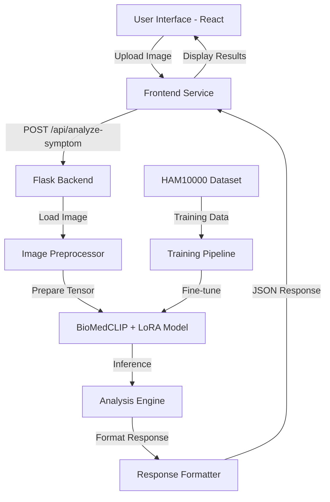

# Symptom Analyzer Feature - Implementation Plan

## Overview
Implement a symptom analyzer feature that uses BioMedCLIP fine-tuned with LoRA on the HAM10000 dataset to analyze medical images and provide severity assessments with recommended actions.

## Architecture



## System Components

### 1. Backend Infrastructure (Flask)

#### 1.1 Model Training Pipeline
**File**: `model/train_biomedclip.py`

**Purpose**: Fine-tune BioMedCLIP with LoRA adapters on HAM10000 dataset

**Key Components**:
- Dataset loader for HAM10000
- BioMedCLIP model initialization
- LoRA configuration (rank=8, alpha=16)
- Training loop with validation
- Model checkpoint saving

**Dependencies**:
```python
torch>=2.0.0
transformers>=4.30.0
peft>=0.4.0
datasets>=2.14.0
open-clip-torch>=2.20.0
pillow>=10.0.0
pandas>=2.0.0
scikit-learn>=1.3.0
```

#### 1.2 Model Inference Service
**File**: `model/inference.py`

**Purpose**: Load trained model and perform inference on uploaded images

**Key Functions**:
- `load_model()`: Load BioMedCLIP with LoRA adapters
- `preprocess_image(image)`: Resize, normalize, convert to tensor
- `analyze_symptom(image)`: Run inference and return predictions
- `assess_severity(predictions)`: Map predictions to severity levels

#### 1.3 Flask API Endpoint
**File**: `app.py` (extend existing)

**New Endpoint**: `POST /api/analyze-symptom`

**Request Format**:
```json
{
  "image": "base64_encoded_image_string"
}
```

**Response Format**:
```json
{
  "success": true,
  "analysis": {
    "condition": "Melanocytic nevus",
    "confidence": 0.87,
    "severity": "mild",
    "severity_score": 2,
    "recommended_action": "Monitor the area. Schedule a routine check-up with your dermatologist within 2-3 months.",
    "additional_notes": "This appears to be a benign mole. Watch for changes in size, shape, or color.",
    "timestamp": "2026-05-16T16:25:00Z"
  }
}
```

**Severity Levels**:
- `severe` (score: 8-10): "Seek immediate medical attention. Contact your physician today."
- `moderate` (score: 4-7): "Schedule an appointment with your physician within 1-2 weeks."
- `mild` (score: 1-3): "Monitor the symptom. Schedule a routine check-up if it persists or worsens."

### 2. Frontend Implementation (React/TypeScript)

#### 2.1 Symptom Analyzer Component
**File**: `frontend/src/components/SymptomAnalyzer.tsx`

**Features**:
- Image upload button with drag-and-drop support
- Image preview before analysis
- Loading state during analysis
- Results display with severity indicator
- Action recommendations
- Error handling

**UI Elements**:
- Upload button with icon
- Image preview card
- Analysis results card with:
  - Condition name
  - Confidence meter (visual progress bar)
  - Severity badge (color-coded: red/yellow/green)
  - Recommended actions
  - Additional notes

#### 2.2 TypeScript Types
**File**: `frontend/src/types/symptom.ts`

```typescript
export type SeverityLevel = 'mild' | 'moderate' | 'severe'

export interface SymptomAnalysis {
  condition: string
  confidence: number
  severity: SeverityLevel
  severity_score: number
  recommended_action: string
  additional_notes: string
  timestamp: string
}

export interface AnalysisResponse {
  success: boolean
  analysis?: SymptomAnalysis
  error?: string
}
```

#### 2.3 API Service
**File**: `frontend/src/services/symptomAnalyzerService.ts`

**Functions**:
- `analyzeSymptom(imageFile: File): Promise<AnalysisResponse>`
- `convertImageToBase64(file: File): Promise<string>`

#### 2.4 Routing
**Update**: `frontend/src/App.tsx`

Add new route:
```typescript
<Route path="/symptom-analyzer" element={<SymptomAnalyzer />} />
```

#### 2.5 Navigation Update
**Update**: `frontend/src/components/TopNav.tsx`

Add navigation link to symptom analyzer

## Implementation Steps

### Phase 1: Backend Setup & Model Training

1. **Environment Setup**
   - Create virtual environment
   - Install Python dependencies
   - Set up project structure

2. **Dataset Preparation**
   - Download HAM10000 dataset
   - Create data preprocessing pipeline
   - Split into train/validation/test sets
   - Implement data augmentation

3. **Model Training**
   - Initialize BioMedCLIP model
   - Configure LoRA adapters
   - Implement training loop
   - Add validation metrics
   - Save model checkpoints

4. **Model Evaluation**
   - Test on validation set
   - Calculate accuracy, precision, recall
   - Verify severity classification logic

### Phase 2: Backend API Development

5. **Inference Service**
   - Create model loading function
   - Implement image preprocessing
   - Build inference pipeline
   - Add severity assessment logic

6. **Flask Endpoint**
   - Create `/api/analyze-symptom` endpoint
   - Handle image upload (base64)
   - Integrate inference service
   - Format response with recommendations
   - Add error handling

7. **Testing**
   - Test with sample images
   - Verify response format
   - Check error scenarios

### Phase 3: Frontend Development

8. **Component Development**
   - Create `SymptomAnalyzer.tsx` component
   - Implement image upload UI
   - Add image preview
   - Build results display

9. **Service Integration**
   - Create API service functions
   - Implement base64 conversion
   - Add error handling
   - Manage loading states

10. **Type Definitions**
    - Define TypeScript interfaces
    - Add type safety for API responses

11. **Routing & Navigation**
    - Add symptom analyzer route
    - Update navigation menu
    - Test navigation flow

### Phase 4: Integration & Testing

12. **End-to-End Testing**
    - Test complete upload flow
    - Verify analysis results
    - Check error handling
    - Test different image types

13. **UI/UX Refinement**
    - Add loading animations
    - Improve error messages
    - Enhance result visualization
    - Add responsive design

14. **Documentation**
    - Update README with new feature
    - Document API endpoints
    - Add usage instructions
    - Include example requests/responses

## Technical Considerations

### Model Training
- **Training Time**: Expect 2-4 hours on GPU (NVIDIA T4 or better)
- **Memory Requirements**: 16GB+ RAM, 8GB+ VRAM
- **Dataset Size**: HAM10000 contains 10,015 images
- **LoRA Configuration**: rank=8, alpha=16, dropout=0.1

### Performance Optimization
- **Model Loading**: Load model once at Flask startup (singleton pattern)
- **Image Size**: Resize to 224x224 for BioMedCLIP
- **Caching**: Consider caching recent analyses
- **Batch Processing**: Support multiple images if needed

### Security & Validation
- **File Type Validation**: Accept only JPEG, PNG
- **File Size Limit**: Max 10MB per image
- **Input Sanitization**: Validate base64 encoding
- **Rate Limiting**: Prevent API abuse

### Error Handling
- **Model Loading Errors**: Graceful fallback
- **Invalid Images**: Clear error messages
- **Network Errors**: Retry logic on frontend
- **Timeout Handling**: Set reasonable timeouts

## File Structure

```
project/
├── app.py                          # Flask backend (extended)
├── requirements.txt                # Python dependencies
├── model/
│   ├── train_biomedclip.py        # Training script
│   ├── inference.py               # Inference service
│   ├── config.py                  # Model configuration
│   └── checkpoints/               # Saved models
│       └── biomedclip_lora/
├── data/
│   └── ham10000/                  # Dataset (gitignored)
├── frontend/
│   └── src/
│       ├── components/
│       │   └── SymptomAnalyzer.tsx
│       ├── services/
│       │   └── symptomAnalyzerService.ts
│       ├── types/
│       │   └── symptom.ts
│       └── App.tsx                # Updated routing
└── SYMPTOM_ANALYZER_PLAN.md      # This document
```

## Dependencies to Install

### Backend (Python)
```bash
pip install torch torchvision
pip install transformers peft datasets
pip install open-clip-torch
pip install pillow pandas scikit-learn
pip install flask-cors  # If not already installed
```

### Frontend (npm)
No additional dependencies required - using existing React setup

## Expected Outcomes

1. **Functional symptom analyzer** that accepts image uploads
2. **Accurate severity assessment** based on BioMedCLIP + LoRA predictions
3. **Clear action recommendations** for users
4. **Seamless UI integration** with existing clinical dashboard
5. **Robust error handling** for edge cases
6. **Well-documented API** for future extensions

## Future Enhancements

- Support for multiple image uploads (comparison)
- Historical analysis tracking
- Integration with patient profile
- Export analysis reports
- Multi-language support for recommendations
- Integration with appointment booking for severe cases
- Real-time physician notification for critical findings

## Notes

- HAM10000 dataset focuses on dermatological conditions, but the approach can be generalized
- Consider adding disclaimer about AI limitations and need for professional medical advice
- Ensure HIPAA compliance if handling real patient data
- Model performance depends on training quality and dataset diversity