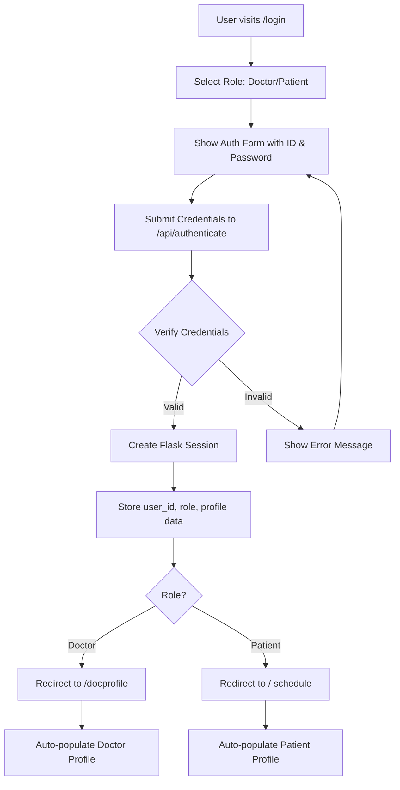
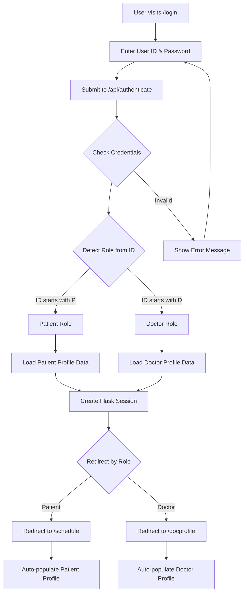

**User:**

<task>
when you start the app, you get to choose between doctor and patient. after that, you get directed to the homepage of doctor or patient view. i want to add an authentication layer in between which prompts user for id, password. when it matches, the home page will appear and user's info will be auto reflected in profile. before you implement this, analyze the codebase and check out how the current flow is
</task>
<environment_details>
# VSCode Visible Files
data\patients.json

# VSCode Open Tabs
model/config.py,data/appointments.json,data/patients.json,chatbot/__init__.py,chatbot/context.py,chatbot/safety.py,chatbot/templates.py,test_chatbot.py,app.py,static/style.css,templates/schedule.html,chatbot/config.py,chatbot/service.py,requirements.txt,CHATBOT_DOCUMENTATION.md,CHATBOT_SETUP.md,.env,data/doctors.json,data/credentials.json,test_json_data.py

# Current Time
Current time in ISO 8601 UTC format: 2026-05-17T03:58:23.288Z
User time zone: Asia/Kuala_Lumpur, UTC+8:00

# Current Cost
$0.00

# Review Exclusions
The following file patterns are excluded from code reviews:
- .vscode/**

# Current Mode
<slug>plan</slug>
<name>📝 Plan</name>

# Current Workspace Directory (c:/Users/Travi/ibm_bob_hackathon-clinical_ai) Files
.gitignore
app.py
CHATBOT_DOCUMENTATION.md
CHATBOT_SETUP.md
DATA_STRUCTURE.md
README.md
requirements.txt
SETUP_INSTRUCTIONS.md
test_api.py
test_chatbot.py
backend/
chatbot/
chatbot/__init__.py
chatbot/config.py
chatbot/context.py
chatbot/safety.py
chatbot/service.py
chatbot/templates.py
data/
data/appointments.json
data/credentials.json
data/doctors.json
data/patient_contacts.json
data/patients.json
frontend/
frontend/src/
frontend/src/App.tsx
frontend/src/components/
frontend/src/components/SymptomAnalyzer.tsx
frontend/src/components/TopNav.tsx
frontend/src/services/
frontend/src/services/symptomAnalyzerService.ts
frontend/src/types/
frontend/src/types/symptom.ts
model/
model/config.py
model/dataset_loader.py
model/inference_pretrained.py
model/inference.py
model/train_biomedclip.py
static/
static/style.css
templates/
templates/appointments.html
templates/docprofile.html
templates/index.html
templates/login.html
templates/patientinfo.html
templates/profile.html
templates/schedule.html
templates/symptom_analyzer.html
You have not created a todo list yet. Create one with `update_todo_list` if your task is complicated or involves multiple steps.
</environment_details>

---

**Assistant:**

I'll analyze the codebase to understand the current authentication flow and how the app handles user selection between doctor and patient views.

<search_files>
<path>.</path>
<regex>@app\.route|def.*login|def.*home|def.*index</regex>
<file_pattern>*.py</file_pattern>
</search_files>

---

**User:**

[search_files for '@app\.route|def.*login|def.*home|def.*index' in '*.py'] Result:
Found 24 results.

# app.py
127 | 
128 | @app.route('/')
129 | def index():
130 |     return render_template('schedule.html',
----
134 | 
135 | @app.route('/schedule')
136 | def schedule():
----
141 | 
142 | @app.route('/appointments')
143 | def appointments():
----
148 | 
149 | @app.route('/profile')
150 | def profile():
----
169 | 
170 | @app.route('/symptom-analyzer')
171 | def symptom_analyzer():
----
178 | 
179 | @app.route('/docprofile')
180 | def docprofile():
----
187 | 
188 | @app.route('/api/doc-profile', methods=['GET'])
189 | def get_doc_profile():
----
195 | 
196 | @app.route('/api/doc-profile', methods=['POST'])
197 | def update_doc_profile():
----
216 | 
217 | @app.route('/login')
218 | def login():
219 |     return render_template('login.html')
----
223 | 
224 | @app.route('/api/book', methods=['POST'])
225 | def book_appointment():
----
269 | 
270 | @app.route('/api/slots/<date>')
271 | def get_slots(date):
----
274 | 
275 | @app.route('/api/doctors')
276 | def get_doctors():
----
289 | 
290 | @app.route('/api/patient')
291 | def get_patient():
----
296 | 
297 | @app.route('/api/all-patients', methods=['GET'])
298 | def get_all_patients():
----
303 | 
304 | @app.route('/patientinfo')
305 | def patientinfo():
----
308 | 
309 | @app.route('/api/next-patient-id')
310 | def next_patient_id():
----
322 | 
323 | @app.route('/api/patients', methods=['POST'])
324 | def save_patient():
----
359 | 
360 | @app.route('/api/analyze-symptom', methods=['POST'])
361 | def analyze_symptom():
----
395 | 
396 | @app.route('/api/patient-contact/<patient_id>', methods=['GET'])
397 | def get_patient_contact(patient_id):
----
403 | 
404 | @app.route('/api/patient-contact', methods=['POST'])
405 | def save_patient_contact():
----
437 | 
438 | @app.route('/api/chatbot/query', methods=['POST'])
439 | def chatbot_query():
----
471 | 
472 | @app.route('/api/chatbot/status', methods=['GET'])
473 | def chatbot_status():
----
491 | 
492 | @app.route('/api/chatbot/history', methods=['GET'])
493 | def chatbot_history():
----
519 | 
520 | @app.route('/api/chatbot/clear', methods=['POST'])
521 | def chatbot_clear():
----
<environment_details>
# VSCode Visible Files
data\patients.json

# VSCode Open Tabs
model/config.py,data/appointments.json,data/patients.json,chatbot/__init__.py,chatbot/context.py,chatbot/safety.py,chatbot/templates.py,test_chatbot.py,app.py,static/style.css,templates/schedule.html,chatbot/config.py,chatbot/service.py,requirements.txt,CHATBOT_DOCUMENTATION.md,CHATBOT_SETUP.md,.env,data/doctors.json,data/credentials.json,test_json_data.py

# Current Time
Current time in ISO 8601 UTC format: 2026-05-17T03:58:27.767Z
User time zone: Asia/Kuala_Lumpur, UTC+8:00

# Current Cost
$0.03

# Review Exclusions
The following file patterns are excluded from code reviews:
- .vscode/**

# Current Mode
<slug>plan</slug>
<name>📝 Plan</name>
You have not created a todo list yet. Create one with `update_todo_list` if your task is complicated or involves multiple steps.
</environment_details>

---

**Assistant:**

<read_file>
<args>
  <file>
    <path>app.py</path>
    <line_range>1-50</line_range>
  </file>
</args>
</read_file>

---

**User:**

[read_file for 'app.py'. Reading multiple files at once is more efficient for the LLM. If other files are relevant to your current task, please read them simultaneously.] Result:
<files>
<file><path>app.py</path>
<content lines="1-50">
 1 | from flask import Flask, render_template, request, jsonify
 2 | from flask_cors import CORS
 3 | from datetime import datetime, timedelta
 4 | import base64
 5 | import io
 6 | from PIL import Image
 7 | import os
 8 | import sys
 9 | import json
10 | 
11 | # Add model directory to path
12 | sys.path.append(os.path.join(os.path.dirname(__file__), 'model'))
13 | 
14 | app = Flask(__name__)
15 | CORS(app)
16 | 
17 | # Import inference service (will be loaded lazily)
18 | inference_service = None
19 | 
20 | def get_inference_service():
21 |     global inference_service
22 |     if inference_service is None:
23 |         try:
24 |             from model.inference_pretrained import get_inference_service as get_service
25 |             inference_service = get_service()
26 |             print("✓ Symptom analyzer loaded (using pre-trained BioMedCLIP)")
27 |         except Exception as e:
28 |             print(f"⚠️ Warning: Could not load symptom analyzer: {e}")
29 |             inference_service = False
30 |     return inference_service if inference_service is not False else None
31 | 
32 | 
33 | # =========================
34 | # GLOBAL ASYNC PROFILE STORE
35 | # =========================
36 | GLOBAL_DOCTOR_PROFILE = {
37 |     "doctor_id": "",
38 |     "name": "",
39 |     "specialty": "",
40 |     "experience": "",
41 |     "bio": ""
42 | }
43 | 
44 | 
45 | def load_json_data(filename):
46 |     try:
47 |         filepath = os.path.join('data', filename)
48 |         with open(filepath, 'r') as f:
49 |             return json.load(f)
50 |     except:
</content>
</file>
</files>
<environment_details>
# VSCode Visible Files
data\patients.json

# VSCode Open Tabs
model/config.py,data/appointments.json,data/patients.json,chatbot/__init__.py,chatbot/context.py,chatbot/safety.py,chatbot/templates.py,test_chatbot.py,app.py,static/style.css,templates/schedule.html,chatbot/config.py,chatbot/service.py,requirements.txt,CHATBOT_DOCUMENTATION.md,CHATBOT_SETUP.md,.env,data/doctors.json,data/credentials.json,test_json_data.py

# Current Time
Current time in ISO 8601 UTC format: 2026-05-17T03:58:30.655Z
User time zone: Asia/Kuala_Lumpur, UTC+8:00

# Current Cost
$0.06

# Review Exclusions
The following file patterns are excluded from code reviews:
- .vscode/**

# Current Mode
<slug>plan</slug>
<name>📝 Plan</name>
You have not created a todo list yet. Create one with `update_todo_list` if your task is complicated or involves multiple steps.
</environment_details>

---

**Assistant:**

<read_file>
<args>
  <file>
    <path>templates/login.html</path>
  </file>
  <file>
    <path>templates/index.html</path>
  </file>
  <file>
    <path>templates/schedule.html</path>
    <line_range>1-100</line_range>
  </file>
  <file>
    <path>data/credentials.json</path>
  </file>
  <file>
    <path>data/doctors.json</path>
  </file>
</args>
</read_file>

---

**User:**

[read_file for 5 files] Result:
<files>
<file><path>templates/login.html</path>
<content lines="1-106">
  1 | <!DOCTYPE html>
  2 | <html lang="en">
  3 | <head>
  4 |     <meta charset="UTF-8">
  5 |     <meta name="viewport" content="width=device-width, initial-scale=1.0">
  6 |     <title>MedAssistant - Login</title>
  7 |     <link rel="stylesheet" href="{{ url_for('static', filename='style.css') }}">
  8 | </head>
  9 | <body class="login-body">
 10 | 
 11 |     

 12 | 
 13 |         <!-- Brand -->
 14 |         

 15 |             <svg width="40" height="40" viewBox="0 0 32 32" fill="none">
 16 |                 <rect x="14" y="8" width="4" height="16" fill="#cc785c"/>
 17 |                 <rect x="8" y="14" width="16" height="4" fill="#cc785c"/>
 18 |                 <circle cx="16" cy="16" r="14" stroke="#cc785c" stroke-width="2" fill="none"/>
 19 |             </svg>
 20 |             <h1 class="login-brand-name">MedAssistant</h1>
 21 |         

 22 | 
 23 |         
Your personal clinical companion

 24 | 
 25 |         <!-- Login Card -->
 26 |         

 27 | 
 28 |             

 29 |                 <h2 class="login-card-title">Welcome back</h2>
 30 |                 
Choose how you'd like to continue

 31 |             

 32 | 
 33 |             

 34 | 
 35 |                 <!-- Doctor Login -->
 36 |                 <button class="login-option-btn login-option-doctor" onclick="loginAs('doctor')">
 37 |                     

 38 |                         <svg width="28" height="28" viewBox="0 0 24 24" fill="none">
 39 |                             <path d="M12 2C9.23858 2 7 4.23858 7 7C7 9.76142 9.23858 12 12 12C14.7614 12 17 9.76142 17 7C17 4.23858 14.7614 2 12 2Z" stroke="currentColor" stroke-width="1.8" stroke-linecap="round"/>
 40 |                             <path d="M3 21C3 17.134 7.02944 14 12 14" stroke="currentColor" stroke-width="1.8" stroke-linecap="round"/>
 41 |                             <path d="M17 17H21M19 15V19" stroke="currentColor" stroke-width="1.8" stroke-linecap="round"/>
 42 |                         </svg>
 43 |                     

 44 |                     

 45 |                         Doctor
 46 |                         Manage your profile & availability
 47 |                     

 48 |                     

 49 |                         <svg width="18" height="18" viewBox="0 0 24 24" fill="none">
 50 |                             <path d="M9 18L15 12L9 6" stroke="currentColor" stroke-width="2" stroke-linecap="round" stroke-linejoin="round"/>
 51 |                         </svg>
 52 |                     

 53 |                 </button>
 54 | 
 55 |                 <!-- Divider -->
 56 |                 

 57 |                     or
 58 |                 

 59 | 
 60 |                 <!-- Patient Login -->
 61 |                 <button class="login-option-btn login-option-patient" onclick="loginAs('patient')">
 62 |                     

 63 |                         <svg width="28" height="28" viewBox="0 0 24 24" fill="none">
 64 |                             <path d="M12 2C9.23858 2 7 4.23858 7 7C7 9.76142 9.23858 12 12 12C14.7614 12 17 9.76142 17 7C17 4.23858 14.7614 2 12 2Z" stroke="currentColor" stroke-width="1.8" stroke-linecap="round"/>
 65 |                             <path d="M3 21C3 17.134 7.02944 14 12 14C16.9706 14 21 17.134 21 21" stroke="currentColor" stroke-width="1.8" stroke-linecap="round"/>
 66 |                         </svg>
 67 |                     

 68 |                     

 69 |                         Patient
 70 |                         Schedule appointments & view records
 71 |                     

 72 |                     

 73 |                         <svg width="18" height="18" viewBox="0 0 24 24" fill="none">
 74 |                             <path d="M9 18L15 12L9 6" stroke="currentColor" stroke-width="2" stroke-linecap="round" stroke-linejoin="round"/>
 75 |                         </svg>
 76 |                     

 77 |                 </button>
 78 | 
 79 |             

 80 | 
 81 |             

 82 |                 This is a proof-of-concept demonstration. No credentials required.
 83 |             

 84 | 
 85 |         

 86 | 
 87 |         
MedAssistant &copy; 2026 &mdash; Clinical Proof of Concept

 88 | 
 89 |     

 90 | 
 91 |     
104 | 
105 | </body>
106 | </html>
</content>
</file>
<file><path>templates/index.html</path>
<content/><notice>File is empty</notice>
</file>
<file><path>templates/schedule.html</path>
<content lines="1-100">
  1 | <!DOCTYPE html>
  2 | <html lang="en">
  3 | <head>
  4 |     <meta charset="UTF-8">
  5 |     <meta name="viewport" content="width=device-width, initial-scale=1.0">
  6 |     <title>MedAssistant - Schedule Appointment</title>
  7 |     <link rel="stylesheet" href="{{ url_for('static', filename='style.css') }}">
  8 | </head>
  9 | <body>
 10 |     <!-- Navigation Header -->
 11 |    <header class="navbar">
 12 |     

 13 |         

 14 |             <svg class="logo-icon" width="32" height="32" viewBox="0 0 32 32" fill="none">
 15 |                 <rect x="14" y="8" width="4" height="16" fill="#2563eb"/>
 16 |                 <rect x="8" y="14" width="16" height="4" fill="#2563eb"/>
 17 |                 <circle cx="16" cy="16" r="14" stroke="#2563eb" stroke-width="2" fill="none"/>
 18 |             </svg>
 19 |             <h1>MedAssistant</h1>
 20 |         

 21 |         <nav class="nav-links" id="main-nav">
 22 |             <!-- Populated by JS based on role -->
 23 |         </nav>
 24 |         <button class="btn btn-secondary" id="logout-btn"
 25 |             style="font-size:13px;height:34px;padding:0 14px;"
 26 |             onclick="logout()">
 27 |             Log out
 28 |         </button>
 29 |     

 30 | </header>
 31 | 
 32 | 
 77 | 
 78 |     <!-- Main Content -->
 79 |     <main class="main-content">
 80 |         

 81 |             

 82 |                 <h2>Schedule Follow-Up Appointment</h2>
 83 |                 
Select a convenient date and time for your next consultation

 84 |             

 85 | 
 86 |             

 87 |                 <!-- Left Column: Chatbot & Appointment Booking -->
 88 |                 <section class="booking-section">
 89 |                     <!-- AI Medical Chatbot -->
 90 |                     

 91 |                         <!-- Header -->
 92 |                         

 93 |                             <h3 class="card-title">💬 Medical Assistant</h3>
 94 |                             
Ask about medications, diet, or appointments

 95 |                         

 96 |                         
 97 |                         <!-- Chat Messages Area -->
 98 |                         

 99 |                             

100 |                                 

</content>
</file>
<file><path>data/credentials.json</path>
<content lines="1-34">
 1 | {
 2 |   "patients": {
 3 |     "P001": {
 4 |       "patient_id": "P001",
 5 |       "password": "patient001"
 6 |     },
 7 |     "P002": {
 8 |       "patient_id": "P002",
 9 |       "password": "patient002"
10 |     },
11 |     "P003": {
12 |       "patient_id": "P003",
13 |       "password": "patient003"
14 |     }
15 |   },
16 |   "doctors": {
17 |     "D001": {
18 |       "doctor_id": "D001",
19 |       "password": "doctor001"
20 |     },
21 |     "D002": {
22 |       "doctor_id": "D002",
23 |       "password": "doctor002"
24 |     },
25 |     "D003": {
26 |       "doctor_id": "D003",
27 |       "password": "doctor003"
28 |     },
29 |     "D004": {
30 |       "doctor_id": "D004",
31 |       "password": "doctor004"
32 |     }
33 |   }
34 | }
</content>
</file>
<file><path>data/doctors.json</path>
<content lines="1-26">
 1 | {
 2 |   "D001": {
 3 |     "doctor_id": "D001",
 4 |     "name": "Dr. Meredith Grey",
 5 |     "specialty": "General Practitioner",
 6 |     "available_days": ["Monday", "Tuesday", "Wednesday", "Thursday", "Friday"]
 7 |   },
 8 |   "D002": {
 9 |     "doctor_id": "D002",
10 |     "name": "Dr. Richard Webber",
11 |     "specialty": "Cardiologist",
12 |     "available_days": ["Monday", "Wednesday", "Friday"]
13 |   },
14 |   "D003": {
15 |     "doctor_id": "D003",
16 |     "name": "Dr. Emily Rodriguez",
17 |     "specialty": "Dermatologist",
18 |     "available_days": ["Tuesday", "Thursday", "Saturday"]
19 |   },
20 |   "D004": {
21 |     "doctor_id": "D004",
22 |     "name": "Dr. James Wilson",
23 |     "specialty": "Pediatrician",
24 |     "available_days": ["Monday", "Tuesday", "Wednesday", "Thursday", "Friday"]
25 |   }
26 | }
</content>
</file>
</files>
<environment_details>
# VSCode Visible Files
data\patients.json

# VSCode Open Tabs
model/config.py,data/appointments.json,data/patients.json,chatbot/__init__.py,chatbot/context.py,chatbot/safety.py,chatbot/templates.py,test_chatbot.py,app.py,static/style.css,templates/schedule.html,chatbot/config.py,chatbot/service.py,requirements.txt,CHATBOT_DOCUMENTATION.md,CHATBOT_SETUP.md,.env,data/doctors.json,data/credentials.json,test_json_data.py

# Current Time
Current time in ISO 8601 UTC format: 2026-05-17T03:58:34.205Z
User time zone: Asia/Kuala_Lumpur, UTC+8:00

# Current Cost
$0.10

# Review Exclusions
The following file patterns are excluded from code reviews:
- .vscode/**

# Current Mode
<slug>plan</slug>
<name>📝 Plan</name>
You have not created a todo list yet. Create one with `update_todo_list` if your task is complicated or involves multiple steps.
</environment_details>

---

**Assistant:**

<read_file>
<args>
  <file>
    <path>data/patients.json</path>
  </file>
  <file>
    <path>templates/profile.html</path>
    <line_range>1-100</line_range>
  </file>
  <file>
    <path>templates/docprofile.html</path>
    <line_range>1-100</line_range>
  </file>
  <file>
    <path>app.py</path>
    <line_range>128-220</line_range>
  </file>
</args>
</read_file>

---

**User:**

[read_file for 4 files] Result:
<files>
<file><path>data/patients.json</path>
<content lines="1-86">
 1 | {
 2 |   "P001": {
 3 |     "patient_id": "P001",
 4 |     "patient_name": "Michael Schumacher",
 5 |     "patient_age": 45,
 6 |     "blood_group": "O+",
 7 |     "allergies": [
 8 |       "Penicillin",
 9 |       "Peanuts",
10 |       "Latex"
11 |     ],
12 |     "symptom": "Persistent cough and mild fever",
13 |     "prescription": [
14 |       {
15 |         "medication": "Amoxicillin 500mg",
16 |         "dosage": "Twice daily",
17 |         "duration": "7 days",
18 |         "notes": "Take with food"
19 |       },
20 |       {
21 |         "medication": "Vitamin D3",
22 |         "dosage": "Once daily",
23 |         "duration": "30 days",
24 |         "notes": "Take with breakfast"
25 |       }
26 |     ],
27 |     "diagnosis": "Upper respiratory tract infection"
28 |   },
29 |   "P002": {
30 |     "patient_id": "P002",
31 |     "patient_name": "Emily Chen",
32 |     "patient_age": 32,
33 |     "blood_group": "A+",
34 |     "allergies": [
35 |       "Sulfa drugs"
36 |     ],
37 |     "symptom": "Seasonal allergies",
38 |     "prescription": [
39 |       {
40 |         "medication": "Cetirizine 10mg",
41 |         "dosage": "Once daily",
42 |         "duration": "30 days",
43 |         "notes": "Take in the evening"
44 |       }
45 |     ],
46 |     "diagnosis": "Allergic rhinitis"
47 |   },
48 |   "P003": {
49 |     "patient_id": "P003",
50 |     "patient_name": "Robert Martinez",
51 |     "patient_age": 58,
52 |     "blood_group": "B+",
53 |     "allergies": [],
54 |     "symptom": "High blood pressure monitoring",
55 |     "prescription": [
56 |       {
57 |         "medication": "Lisinopril 10mg",
58 |         "dosage": "Once daily",
59 |         "duration": "90 days",
60 |         "notes": "Take in the morning"
61 |       }
62 |     ],
63 |     "diagnosis": "Hypertension - Stage 1"
64 |   },
65 |   "P004": {
66 |     "patient_id": "P004",
67 |     "patient_name": "Slum",
68 |     "patient_age": 20,
69 |     "blood_group": "A+",
70 |     "allergies": [
71 |       "Corn"
72 |     ],
73 |     "symptom": "Cough",
74 |     "diagnosis": "Phelm",
75 |     "appointment_details": "Follow up in 1 week",
76 |     "dietary_restrictions": "No spicy and oily food",
77 |     "prescription": [
78 |       {
79 |         "medication": "Cocaine",
80 |         "dosage": "2",
81 |         "duration": "1 month",
82 |         "notes": "Raw"
83 |       }
84 |     ]
85 |   }
86 | }
</content>
</file>
<file><path>templates/profile.html</path>
<content lines="1-100">
  1 | <!DOCTYPE html>
  2 | <html lang="en">
  3 | <head>
  4 |     <meta charset="UTF-8">
  5 |     <meta name="viewport" content="width=device-width, initial-scale=1.0">
  6 |     <title>MedAssistant - My Profile</title>
  7 |     <link rel="stylesheet" href="{{ url_for('static', filename='style.css') }}">
  8 | </head>
  9 | <body>
 10 |     <header class="navbar">
 11 |     

 12 |         

 13 |             <svg class="logo-icon" width="32" height="32" viewBox="0 0 32 32" fill="none">
 14 |                 <rect x="14" y="8" width="4" height="16" fill="#2563eb"/>
 15 |                 <rect x="8" y="14" width="16" height="4" fill="#2563eb"/>
 16 |                 <circle cx="16" cy="16" r="14" stroke="#2563eb" stroke-width="2" fill="none"/>
 17 |             </svg>
 18 |             <h1>MedAssistant</h1>
 19 |         

 20 |         <nav class="nav-links" id="main-nav">
 21 |             </nav>
 22 |         
 23 |         

 24 |             

 25 |                 <svg id="profile-dropdown-btn" width="28" height="28" viewBox="0 0 24 24" fill="none" stroke="currentColor" stroke-width="2" stroke-linecap="round" stroke-linejoin="round" style="cursor: pointer; color: var(--color-ink); margin-top: 5px;">
 26 |                     <path d="M20 21V19C20 17.9391 19.5786 16.9217 18.8284 16.1716C18.0783 15.4214 17.0609 15 16 15H8C6.93913 15 5.92172 15.4214 5.17157 16.1716C4.42143 16.9217 4 17.9391 4 19V21"></path>
 27 |                     <circle cx="12" cy="7" r="4"></circle>
 28 |                 </svg>
 29 |                 
 30 |                 

 31 |                     

 32 |             

 33 |             <button class="btn btn-secondary" id="logout-btn"
 34 |                 style="font-size:13px;height:34px;padding:0 14px;"
 35 |                 onclick="logout()">
 36 |                 Log out
 37 |             </button>
 38 |         

 39 |     

 40 | </header>
 41 | 
 42 | 
 64 | 
 65 |     <main class="main-content">
 66 |         

 67 |             

 68 |                 <h2>My Profile</h2>
 69 |                 
Manage your personal and medical information

 70 |             

 71 | 
 72 |             

 73 |                 <section class="card profile-header-card">
 74 |                     

 75 |                         

 76 |                             <svg width="80" height="80" viewBox="0 0 24 24" fill="none" xmlns="http://www.w3.org/2000/svg">
 77 |                                 <path d="M20 21V19C20 17.9391 19.5786 16.9217 18.8284 16.1716C18.0783 15.4214 17.0609 15 16 15H8C6.93913 15 5.92172 15.4214 5.17157 16.1716C4.42143 16.9217 4 17.9391 4 19V21" stroke="currentColor" stroke-width="2" stroke-linecap="round" stroke-linejoin="round"/>
 78 |                                 <path d="M12 11C14.2091 11 16 9.20914 16 7C16 4.79086 14.2091 3 12 3C9.79086 3 8 4.79086 8 7C8 9.20914 9.79086 11 12 11Z" stroke="currentColor" stroke-width="2" stroke-linecap="round" stroke-linejoin="round"/>
 79 |                             </svg>
 80 |                         

 81 |                         

 82 |                             <h3 class="profile-name" id="display-name">Select a Patient from Top Right</h3>
 83 |                             

 84 |                                 
 85 |                                     -- years old
 86 |                                 
 87 |                                 
 88 |                                     Blood Group: --
 89 |                                 
 90 |                             

 91 |                         

 92 |                     

 93 |                 </section>
 94 | 
 95 |                 

 96 |                     

 97 |                         
 98 |                         <section class="card">
 99 |                             <h3 class="card-title">Personal Information</h3>
100 |                             

</content>
</file>
<file><path>templates/docprofile.html</path>
<content lines="1-100">
  1 | <!DOCTYPE html>
  2 | <html lang="en">
  3 | <head>
  4 |     <meta charset="UTF-8">
  5 |     <meta name="viewport" content="width=device-width, initial-scale=1.0">
  6 |     <title>MedAssistant - Doctor Profile Setup</title>
  7 |     <link rel="stylesheet" href="{{ url_for('static', filename='style.css') }}">
  8 | </head>
  9 | <body>
 10 | 
 11 | <header class="navbar">
 12 |     

 13 |         

 14 |             <svg class="logo-icon" width="32" height="32" viewBox="0 0 32 32" fill="none">
 15 |                 <rect x="14" y="8" width="4" height="16" fill="#2563eb"/>
 16 |                 <rect x="8" y="14" width="16" height="4" fill="#2563eb"/>
 17 |                 <circle cx="16" cy="16" r="14" stroke="#2563eb" stroke-width="2" fill="none"/>
 18 |             </svg>
 19 |             <h1>MedAssistant</h1>
 20 |         

 21 |         <nav class="nav-links" id="main-nav">
 22 |             <!-- Populated by JS based on role -->
 23 |         </nav>
 24 |         <button class="btn btn-secondary" id="logout-btn"
 25 |             style="font-size:13px;height:34px;padding:0 14px;"
 26 |             onclick="logout()">
 27 |             Log out
 28 |         </button>
 29 |     

 30 | </header>
 31 | 
 32 | 
 77 | 
 78 | <main class="main-content">
 79 |     

 80 | 
 81 |         

 82 |             <h2>Manage Doctor Profile</h2>
 83 |             
Update your professional details and consultation settings

 84 |         

 85 | 
 86 |         

 87 | 
 88 |             <!-- FORM -->
 89 |             <section class="booking-section">
 90 |                 

 91 |                     <h3 class="card-title">Professional Credentials</h3>
 92 | 
 93 |                     <!-- Async form (NO Flask POST) -->
 94 |                     <form id="profile-form">
 95 | 
 96 |                         

 97 |                             <label>Doctor ID</label>
 98 |                             <input type="text" id="doctor_id" class="form-select" placeholder="e.g. D001">
 99 |                         

100 | 
</content>
</file>
<file><path>app.py</path>
<content lines="128-220">
128 | @app.route('/')
129 | def index():
130 |     return render_template('schedule.html',
131 |                          available_slots=available_slots,
132 |                          upcoming_tasks=upcoming_tasks)
133 | 
134 | 
135 | @app.route('/schedule')
136 | def schedule():
137 |     return render_template('schedule.html',
138 |                          available_slots=available_slots,
139 |                          upcoming_tasks=upcoming_tasks)
140 | 
141 | 
142 | @app.route('/appointments')
143 | def appointments():
144 |     patient_appointments = get_patient_appointments(CURRENT_PATIENT_ID)
145 |     return render_template('appointments.html',
146 |                          booked_appointments=patient_appointments)
147 | 
148 | 
149 | @app.route('/profile')
150 | def profile():
151 |     patient = get_current_patient()
152 |     patient_profile = {
153 |         'name': patient.get('patient_name', 'Unknown'),
154 |         'age': patient.get('patient_age', 0),
155 |         'blood_group': patient.get('blood_group', 'Unknown'),
156 |         'contact_number': patient.get('contact_number', ''),
157 |         'email': patient.get('email', ''),
158 |         'allergies': patient.get('allergies', []),
159 |         'current_medications': [
160 |             f"{med['medication']} - {med['dosage']}"
161 |             for med in patient.get('prescription', [])
162 |         ],
163 |         'emergency_contact': patient.get('emergency_contact', {})
164 |     }
165 | 
166 |     return render_template('profile.html',
167 |                          patient_profile=patient_profile)
168 | 
169 | 
170 | @app.route('/symptom-analyzer')
171 | def symptom_analyzer():
172 |     return render_template('symptom_analyzer.html')
173 | 
174 | 
175 | # =========================
176 | # DOCTOR PROFILE PAGE
177 | # =========================
178 | 
179 | @app.route('/docprofile')
180 | def docprofile():
181 |     return render_template('docprofile.html')
182 | 
183 | 
184 | # =========================
185 | # GLOBAL ASYNC API
186 | # =========================
187 | 
188 | @app.route('/api/doc-profile', methods=['GET'])
189 | def get_doc_profile():
190 |     return jsonify({
191 |         "success": True,
192 |         "profile": GLOBAL_DOCTOR_PROFILE
193 |     })
194 | 
195 | 
196 | @app.route('/api/doc-profile', methods=['POST'])
197 | def update_doc_profile():
198 |     global GLOBAL_DOCTOR_PROFILE
199 | 
200 |     data = request.get_json()
201 | 
202 |     GLOBAL_DOCTOR_PROFILE = {
203 |         "doctor_id": data.get("doctor_id", ""),
204 |         "name": data.get("name", ""),
205 |         "specialty": data.get("specialty", ""),
206 |         "experience": data.get("experience", ""),
207 |         "bio": data.get("bio", "")
208 |     }
209 | 
210 |     return jsonify({
211 |         "success": True,
212 |         "message": "Doctor profile updated successfully",
213 |         "profile": GLOBAL_DOCTOR_PROFILE
214 |     })
215 | 
216 | 
217 | @app.route('/login')
218 | def login():
219 |     return render_template('login.html')
220 | # =========================
</content>
</file>
</files>
<environment_details>
# VSCode Visible Files
data\patients.json

# VSCode Open Tabs
model/config.py,data/appointments.json,data/patients.json,chatbot/__init__.py,chatbot/context.py,chatbot/safety.py,chatbot/templates.py,test_chatbot.py,app.py,static/style.css,templates/schedule.html,chatbot/config.py,chatbot/service.py,requirements.txt,CHATBOT_DOCUMENTATION.md,CHATBOT_SETUP.md,.env,data/doctors.json,data/credentials.json,test_json_data.py

# Current Time
Current time in ISO 8601 UTC format: 2026-05-17T03:58:38.075Z
User time zone: Asia/Kuala_Lumpur, UTC+8:00

# Current Cost
$0.15

# Review Exclusions
The following file patterns are excluded from code reviews:
- .vscode/**

# Current Mode
<slug>plan</slug>
<name>📝 Plan</name>
You have not created a todo list yet. Create one with `update_todo_list` if your task is complicated or involves multiple steps.
</environment_details>

---

**Assistant:**

Now I have a clear understanding of the current authentication flow. Let me create a comprehensive plan for adding the authentication layer.

## Current Flow Analysis

**Current Authentication Flow:**
1. User visits [`/login`](templates/login.html) route
2. User selects role (Doctor or Patient) via buttons
3. Role is stored in `localStorage` as `userRole`
4. User is redirected:
   - Doctor → [`/docprofile`](templates/docprofile.html)
   - Patient → [`/`](templates/schedule.html) (schedule page)
5. Each page checks `localStorage.userRole` and redirects if missing
6. No actual credential verification occurs

**Key Findings:**
- [`data/credentials.json`](data/credentials.json) exists with patient/doctor IDs and passwords
- [`data/patients.json`](data/patients.json) contains patient profile data
- [`data/doctors.json`](data/doctors.json) contains doctor profile data
- Current [`login.html`](templates/login.html:92-102) only stores role, no authentication
- Profile pages expect to load user data but currently use hardcoded IDs
- [`app.py`](app.py:128-220) has routes but no session management

<update_todo_list>
<todos>
[ ] Create authentication HTML template with ID/password input fields
[ ] Add Flask session management and secret key configuration
[ ] Create backend API endpoint for credential verification
[ ] Implement session storage for authenticated user data
[ ] Update login flow to show role selection first, then auth form
[ ] Modify profile routes to use session data instead of hardcoded IDs
[ ] Update frontend JavaScript to handle authenticated user context
[ ] Add session-based route protection middleware
[ ] Update patient profile page to auto-populate from session data
[ ] Update doctor profile page to auto-populate from session data
[ ] Test complete authentication flow for both roles
[ ] Add logout functionality to clear session data
</todos>
</update_todo_list>

---

**User:**

[TASK RESUMPTION] Resuming task...
<environment_details>
# VSCode Visible Files
data\patients.json

# VSCode Open Tabs
model/config.py,data/appointments.json,data/patients.json,chatbot/__init__.py,chatbot/context.py,chatbot/safety.py,chatbot/templates.py,test_chatbot.py,app.py,static/style.css,templates/schedule.html,chatbot/config.py,chatbot/service.py,requirements.txt,CHATBOT_DOCUMENTATION.md,CHATBOT_SETUP.md,.env,data/doctors.json,data/credentials.json,test_json_data.py

# Current Time
Current time in ISO 8601 UTC format: 2026-05-17T04:00:22.499Z
User time zone: Asia/Kuala_Lumpur, UTC+8:00

# Current Cost
$0.21

# Review Exclusions
The following file patterns are excluded from code reviews:
- .vscode/**

# Current Mode
<slug>plan</slug>
<name>📝 Plan</name>

# Current Workspace Directory (c:/Users/Travi/ibm_bob_hackathon-clinical_ai) Files
.gitignore
app.py
CHATBOT_DOCUMENTATION.md
CHATBOT_SETUP.md
DATA_STRUCTURE.md
README.md
requirements.txt
SETUP_INSTRUCTIONS.md
test_api.py
test_chatbot.py
backend/
chatbot/
chatbot/__init__.py
chatbot/config.py
chatbot/context.py
chatbot/safety.py
chatbot/service.py
chatbot/templates.py
data/
data/appointments.json
data/credentials.json
data/doctors.json
data/patient_contacts.json
data/patients.json
frontend/
frontend/src/
frontend/src/App.tsx
frontend/src/components/
frontend/src/components/SymptomAnalyzer.tsx
frontend/src/components/TopNav.tsx
frontend/src/services/
frontend/src/services/symptomAnalyzerService.ts
frontend/src/types/
frontend/src/types/symptom.ts
model/
model/config.py
model/dataset_loader.py
model/inference_pretrained.py
model/inference.py
model/train_biomedclip.py
static/
static/style.css
templates/
templates/appointments.html
templates/docprofile.html
templates/index.html
templates/login.html
templates/patientinfo.html
templates/profile.html
templates/schedule.html
templates/symptom_analyzer.html
====

REMINDERS

Below is your current list of reminders for this task. Keep them updated as you progress.

| # | Content | Status |
|---|---------|--------|
| 1 | Create authentication HTML template with ID/password input fields | Pending |
| 2 | Add Flask session management and secret key configuration | Pending |
| 3 | Create backend API endpoint for credential verification | Pending |
| 4 | Implement session storage for authenticated user data | Pending |
| 5 | Update login flow to show role selection first, then auth form | Pending |
| 6 | Modify profile routes to use session data instead of hardcoded IDs | Pending |
| 7 | Update frontend JavaScript to handle authenticated user context | Pending |
| 8 | Add session-based route protection middleware | Pending |
| 9 | Update patient profile page to auto-populate from session data | Pending |
| 10 | Update doctor profile page to auto-populate from session data | Pending |
| 11 | Test complete authentication flow for both roles | Pending |
| 12 | Add logout functionality to clear session data | Pending |

IMPORTANT: When task status changes, remember to call the `update_todo_list` tool to update your progress.

</environment_details>

---

**Assistant:**

Perfect! I've analyzed the codebase and created a detailed plan. Let me now present my findings and proposed implementation strategy.

## 📋 Current Authentication Flow Analysis

### **Existing Flow:**
1. User visits [`/login`](templates/login.html) 
2. Clicks "Doctor" or "Patient" button
3. Role stored in `localStorage.userRole`
4. Redirected to respective homepage (no credential check)
5. Pages verify role exists in localStorage (client-side only)

### **Key Issues:**
- ❌ No actual authentication - anyone can access by setting localStorage
- ❌ No server-side session management
- ❌ User data is hardcoded (e.g., `CURRENT_PATIENT_ID = "P001"` in [`app.py`](app.py))
- ❌ Profile pages don't auto-populate with logged-in user's data

### **Available Resources:**
- ✅ [`data/credentials.json`](data/credentials.json) - Contains user IDs and passwords
- ✅ [`data/patients.json`](data/patients.json) - Patient profile data
- ✅ [`data/doctors.json`](data/doctors.json) - Doctor profile data

## 🎯 Proposed Authentication Architecture

## 📝 Implementation Plan

I've created a comprehensive todo list with the following key steps:

### **Phase 1: Backend Authentication (Steps 1-4)**
- Add Flask session management with secret key
- Create `/api/authenticate` endpoint to verify credentials
- Implement session storage for user data
- Add session-based route protection

### **Phase 2: Frontend Updates (Steps 5-7)**
- Modify login page to show auth form after role selection
- Update all pages to use session data instead of localStorage
- Handle authentication errors gracefully

### **Phase 3: Profile Integration (Steps 8-10)**
- Update patient profile to auto-populate from session
- Update doctor profile to auto-populate from session
- Ensure all API endpoints respect authenticated user context

### **Phase 4: Testing & Security (Steps 11-12)**
- Test complete flow for both doctor and patient roles
- Verify logout clears session properly
- Ensure protected routes redirect to login

<ask_followup_question>
<question>Would you like me to proceed with implementing this authentication system? I can switch to Code mode to start building the solution.</question>
<follow_up>
<suggest mode="code">Yes, implement the complete authentication system with all the planned features</suggest>
<suggest>Wait, I'd like to modify the plan first - let me provide specific requirements</suggest>
<suggest>Show me more details about how the session data will be structured</suggest>
<suggest>Can you create a simpler version without Flask sessions, using just localStorage with credential verification?</suggest>
</follow_up>
</ask_followup_question>

---

**User:**

[ask_followup_question for 'Would you like me to proceed with implementing this authentication system? I can switch to Code mode to start building the solution.'] Result:
<answer>
Wait, I'd like to modify the plan first - let me provide specific requirements
</answer>
<environment_details>
# VSCode Visible Files
data\patients.json

# VSCode Open Tabs
model/config.py,data/appointments.json,data/patients.json,chatbot/__init__.py,chatbot/context.py,chatbot/safety.py,chatbot/templates.py,test_chatbot.py,app.py,static/style.css,templates/schedule.html,chatbot/config.py,chatbot/service.py,requirements.txt,CHATBOT_DOCUMENTATION.md,CHATBOT_SETUP.md,.env,data/doctors.json,data/credentials.json,test_json_data.py

# Current Time
Current time in ISO 8601 UTC format: 2026-05-17T04:04:37.665Z
User time zone: Asia/Kuala_Lumpur, UTC+8:00

# Current Cost
$0.28

# Review Exclusions
The following file patterns are excluded from code reviews:
- .vscode/**

# Current Mode
<slug>plan</slug>
<name>📝 Plan</name>
====

REMINDERS

Below is your current list of reminders for this task. Keep them updated as you progress.

| # | Content | Status |
|---|---------|--------|
| 1 | Create authentication HTML template with ID/password input fields | Pending |
| 2 | Add Flask session management and secret key configuration | Pending |
| 3 | Create backend API endpoint for credential verification | Pending |
| 4 | Implement session storage for authenticated user data | Pending |
| 5 | Update login flow to show role selection first, then auth form | Pending |
| 6 | Modify profile routes to use session data instead of hardcoded IDs | Pending |
| 7 | Update frontend JavaScript to handle authenticated user context | Pending |
| 8 | Add session-based route protection middleware | Pending |
| 9 | Update patient profile page to auto-populate from session data | Pending |
| 10 | Update doctor profile page to auto-populate from session data | Pending |
| 11 | Test complete authentication flow for both roles | Pending |
| 12 | Add logout functionality to clear session data | Pending |

IMPORTANT: When task status changes, remember to call the `update_todo_list` tool to update your progress.

</environment_details>

---

**Assistant:**

Great! Please share your specific requirements or modifications to the plan. What aspects would you like to adjust?

Some areas you might want to customize:

1. **Authentication Flow**: Should users select role first, then authenticate? Or enter credentials that determine their role automatically?

2. **Session vs localStorage**: Do you prefer Flask server-side sessions, or a hybrid approach with localStorage?

3. **Profile Auto-population**: Which specific fields should be auto-filled from the authenticated user's data?

4. **Error Handling**: How should invalid login attempts be displayed? (Error messages, retry limits, etc.)

5. **Security Level**: Should we add features like password hashing, session timeouts, or "remember me" functionality?

6. **UI/UX**: Should the authentication form be on the same page as role selection, or a separate step?

Please let me know your specific requirements, and I'll update the implementation plan accordingly!

---

**User:**

[ERROR] You did not use a tool in your previous response! Please retry with a tool use.

# Reminder: Instructions for Tool Use

Tool uses are formatted using XML-style tags. The tool name itself becomes the XML tag name. Each parameter is enclosed within its own set of tags. Here's the structure:

<actual_tool_name>
<parameter1_name>value1</parameter1_name>
<parameter2_name>value2</parameter2_name>
...
</actual_tool_name>

For example, to use the attempt_completion tool:

<attempt_completion>
<result>
I have completed the task...
</result>
</attempt_completion>

Always use the actual tool name as the XML tag name for proper parsing and execution.

# Next Steps

If you have completed the user's task, use the attempt_completion tool.
If you require additional information from the user, use the ask_followup_question tool.
Otherwise, if you have not completed the task and do not need additional information, then proceed with the next step of the task.
(This is an automated message, so do not respond to it conversationally.)
<environment_details>
# VSCode Visible Files
data\patients.json

# VSCode Open Tabs
model/config.py,data/appointments.json,data/patients.json,chatbot/__init__.py,chatbot/context.py,chatbot/safety.py,chatbot/templates.py,test_chatbot.py,app.py,static/style.css,templates/schedule.html,chatbot/config.py,chatbot/service.py,requirements.txt,CHATBOT_DOCUMENTATION.md,CHATBOT_SETUP.md,.env,data/doctors.json,data/credentials.json,test_json_data.py

# Current Time
Current time in ISO 8601 UTC format: 2026-05-17T04:04:43.672Z
User time zone: Asia/Kuala_Lumpur, UTC+8:00

# Current Cost
$0.35

# Review Exclusions
The following file patterns are excluded from code reviews:
- .vscode/**

# Current Mode
<slug>plan</slug>
<name>📝 Plan</name>
====

REMINDERS

Below is your current list of reminders for this task. Keep them updated as you progress.

| # | Content | Status |
|---|---------|--------|
| 1 | Create authentication HTML template with ID/password input fields | Pending |
| 2 | Add Flask session management and secret key configuration | Pending |
| 3 | Create backend API endpoint for credential verification | Pending |
| 4 | Implement session storage for authenticated user data | Pending |
| 5 | Update login flow to show role selection first, then auth form | Pending |
| 6 | Modify profile routes to use session data instead of hardcoded IDs | Pending |
| 7 | Update frontend JavaScript to handle authenticated user context | Pending |
| 8 | Add session-based route protection middleware | Pending |
| 9 | Update patient profile page to auto-populate from session data | Pending |
| 10 | Update doctor profile page to auto-populate from session data | Pending |
| 11 | Test complete authentication flow for both roles | Pending |
| 12 | Add logout functionality to clear session data | Pending |

IMPORTANT: When task status changes, remember to call the `update_todo_list` tool to update your progress.

</environment_details>

---

**Assistant:**

<ask_followup_question>
<question>What specific requirements or modifications would you like to make to the authentication plan? Please share your preferences for the implementation.</question>
<follow_up>
<suggest>Keep the two-step flow: role selection first, then ID/password authentication</suggest>
<suggest>Use Flask server-side sessions for security with session timeout after 30 minutes</suggest>
<suggest>Auto-populate all profile fields from the authenticated user's data in patients.json/doctors.json</suggest>
<suggest>Show inline error messages for invalid credentials with a 3-attempt limit before temporary lockout</suggest>
</follow_up>
</ask_followup_question>

---

**User:**

[ask_followup_question for 'What specific requirements or modifications would you like to make to the authentication plan? Please share your preferences for the implementation.'] Result:
<answer>
1) enter credentials that determine their role.
2) flask server-side
3) whichever is currently shown or relevant for profile.
4) error message
5) no, this is just a mvp.
6) we are automating the role selection based on credential input now
</answer>
<environment_details>
# VSCode Visible Files
data\patients.json

# VSCode Open Tabs
model/config.py,data/appointments.json,data/patients.json,chatbot/__init__.py,chatbot/context.py,chatbot/safety.py,chatbot/templates.py,test_chatbot.py,app.py,static/style.css,templates/schedule.html,chatbot/config.py,chatbot/service.py,requirements.txt,CHATBOT_DOCUMENTATION.md,CHATBOT_SETUP.md,.env,data/doctors.json,data/credentials.json,test_json_data.py

# Current Time
Current time in ISO 8601 UTC format: 2026-05-17T04:06:43.456Z
User time zone: Asia/Kuala_Lumpur, UTC+8:00

# Current Cost
$0.42

# Review Exclusions
The following file patterns are excluded from code reviews:
- .vscode/**

# Current Mode
<slug>plan</slug>
<name>📝 Plan</name>
====

REMINDERS

Below is your current list of reminders for this task. Keep them updated as you progress.

| # | Content | Status |
|---|---------|--------|
| 1 | Create authentication HTML template with ID/password input fields | Pending |
| 2 | Add Flask session management and secret key configuration | Pending |
| 3 | Create backend API endpoint for credential verification | Pending |
| 4 | Implement session storage for authenticated user data | Pending |
| 5 | Update login flow to show role selection first, then auth form | Pending |
| 6 | Modify profile routes to use session data instead of hardcoded IDs | Pending |
| 7 | Update frontend JavaScript to handle authenticated user context | Pending |
| 8 | Add session-based route protection middleware | Pending |
| 9 | Update patient profile page to auto-populate from session data | Pending |
| 10 | Update doctor profile page to auto-populate from session data | Pending |
| 11 | Test complete authentication flow for both roles | Pending |
| 12 | Add logout functionality to clear session data | Pending |

IMPORTANT: When task status changes, remember to call the `update_todo_list` tool to update your progress.

</environment_details>

---

**Assistant:**

<update_todo_list>
<todos>
[ ] Add Flask session management and secret key configuration to app.py
[ ] Create backend API endpoint /api/authenticate for credential verification
[ ] Implement automatic role detection based on credential prefix (P=patient, D=doctor)
[ ] Store authenticated user data in Flask session (user_id, role, profile)
[ ] Update login.html to single-step auth form (ID + password only)
[ ] Create session-based route protection for all protected routes
[ ] Update profile routes to fetch data from session instead of hardcoded IDs
[ ] Update patient profile page to auto-populate from session user data
[ ] Update doctor profile page to auto-populate from session user data
[ ] Update all API endpoints to use session user_id instead of hardcoded values
[ ] Add logout functionality to clear Flask session
[ ] Update frontend JavaScript to handle authentication errors with inline messages
</todos>
</update_todo_list>

---

**User:**

[update_todo_list] Result:
Todo list updated successfully.
<environment_details>
# VSCode Visible Files
data\patients.json

# VSCode Open Tabs
model/config.py,data/appointments.json,data/patients.json,chatbot/__init__.py,chatbot/context.py,chatbot/safety.py,chatbot/templates.py,test_chatbot.py,app.py,static/style.css,templates/schedule.html,chatbot/config.py,chatbot/service.py,requirements.txt,CHATBOT_DOCUMENTATION.md,CHATBOT_SETUP.md,.env,data/doctors.json,data/credentials.json,test_json_data.py

# Current Time
Current time in ISO 8601 UTC format: 2026-05-17T04:07:00.038Z
User time zone: Asia/Kuala_Lumpur, UTC+8:00

# Current Cost
$0.50

# Review Exclusions
The following file patterns are excluded from code reviews:
- .vscode/**

# Current Mode
<slug>plan</slug>
<name>📝 Plan</name>
====

REMINDERS

Below is your current list of reminders for this task. Keep them updated as you progress.

| # | Content | Status |
|---|---------|--------|
| 1 | Add Flask session management and secret key configuration to app.py | Pending |
| 2 | Create backend API endpoint /api/authenticate for credential verification | Pending |
| 3 | Implement automatic role detection based on credential prefix (P=patient, D=doctor) | Pending |
| 4 | Store authenticated user data in Flask session (user_id, role, profile) | Pending |
| 5 | Update login.html to single-step auth form (ID + password only) | Pending |
| 6 | Create session-based route protection for all protected routes | Pending |
| 7 | Update profile routes to fetch data from session instead of hardcoded IDs | Pending |
| 8 | Update patient profile page to auto-populate from session user data | Pending |
| 9 | Update doctor profile page to auto-populate from session user data | Pending |
| 10 | Update all API endpoints to use session user_id instead of hardcoded values | Pending |
| 11 | Add logout functionality to clear Flask session | Pending |
| 12 | Update frontend JavaScript to handle authentication errors with inline messages | Pending |

IMPORTANT: When task status changes, remember to call the `update_todo_list` tool to update your progress.

</environment_details>

---

**Assistant:**

Perfect! I've updated the plan based on your requirements. Here's the revised implementation strategy:

## 🔄 Updated Authentication Architecture

## 📋 Key Changes from Original Plan

1. **Simplified Login Flow**: Single form with ID + Password (no role selection button)
2. **Automatic Role Detection**: System determines role from credential prefix (P001 = Patient, D001 = Doctor)
3. **Flask Server-Side Sessions**: Secure session management on backend
4. **MVP Approach**: Basic error messages, no advanced security features
5. **Profile Auto-population**: All relevant fields populated from session data

## 🎯 Implementation Summary

The updated plan includes 12 steps that will:
- Replace the current role-selection UI with a credential form
- Add Flask session management with automatic role detection
- Protect all routes with session-based authentication
- Auto-populate user profiles from session data
- Handle authentication errors with inline messages

<ask_followup_question>
<question>The plan is now updated based on your requirements. Should I proceed with implementation by switching to Code mode?</question>
<follow_up>
<suggest mode="code">Yes, proceed with implementing the authentication system</suggest>
<suggest>Show me the updated credential structure in credentials.json first</suggest>
<suggest>Explain how the automatic role detection will work in more detail</suggest>
</follow_up>
</ask_followup_question>

---

**User:**

[ask_followup_question for 'The plan is now updated based on your requirements. Should I proceed with implementation by switching to Code mode?'] Result:
<answer>
Yes, proceed with implementing the authentication system
</answer>
<environment_details>
# VSCode Visible Files
data\patients.json

# VSCode Open Tabs
model/config.py,data/appointments.json,data/patients.json,chatbot/__init__.py,chatbot/context.py,chatbot/safety.py,chatbot/templates.py,test_chatbot.py,app.py,static/style.css,templates/schedule.html,chatbot/config.py,chatbot/service.py,requirements.txt,CHATBOT_DOCUMENTATION.md,CHATBOT_SETUP.md,.env,data/doctors.json,data/credentials.json,test_json_data.py

# Current Time
Current time in ISO 8601 UTC format: 2026-05-17T04:07:27.995Z
User time zone: Asia/Kuala_Lumpur, UTC+8:00

# Current Cost
$0.58

# Review Exclusions
The following file patterns are excluded from code reviews:
- .vscode/**

# Current Mode
<slug>code</slug>
<name>💻 Code</name>
====

REMINDERS

Below is your current list of reminders for this task. Keep them updated as you progress.

| # | Content | Status |
|---|---------|--------|
| 1 | Add Flask session management and secret key configuration to app.py | Pending |
| 2 | Create backend API endpoint /api/authenticate for credential verification | Pending |
| 3 | Implement automatic role detection based on credential prefix (P=patient, D=doctor) | Pending |
| 4 | Store authenticated user data in Flask session (user_id, role, profile) | Pending |
| 5 | Update login.html to single-step auth form (ID + password only) | Pending |
| 6 | Create session-based route protection for all protected routes | Pending |
| 7 | Update profile routes to fetch data from session instead of hardcoded IDs | Pending |
| 8 | Update patient profile page to auto-populate from session user data | Pending |
| 9 | Update doctor profile page to auto-populate from session user data | Pending |
| 10 | Update all API endpoints to use session user_id instead of hardcoded values | Pending |
| 11 | Add logout functionality to clear Flask session | Pending |
| 12 | Update frontend JavaScript to handle authentication errors with inline messages | Pending |

IMPORTANT: When task status changes, remember to call the `update_todo_list` tool to update your progress.

</environment_details>

---

**Assistant:**

<switch_mode>
<mode_slug>code</mode_slug>
<reason>User approved implementation - switching to Code mode to build the authentication system</reason>
</switch_mode>

---

**User:**

[switch_mode to 'code' because: User approved implementation - switching to Code mode to build the authentication system] Result:
Already in 💻 Code mode.
<environment_details>
# VSCode Visible Files
data\patients.json

# VSCode Open Tabs
model/config.py,data/appointments.json,data/patients.json,chatbot/__init__.py,chatbot/context.py,chatbot/safety.py,chatbot/templates.py,test_chatbot.py,app.py,static/style.css,templates/schedule.html,chatbot/config.py,chatbot/service.py,requirements.txt,CHATBOT_DOCUMENTATION.md,CHATBOT_SETUP.md,.env,data/doctors.json,data/credentials.json,test_json_data.py

# Current Time
Current time in ISO 8601 UTC format: 2026-05-17T04:07:32.014Z
User time zone: Asia/Kuala_Lumpur, UTC+8:00

# Current Cost
$0.64

# Review Exclusions
The following file patterns are excluded from code reviews:
- .vscode/**

# Current Mode
<slug>code</slug>
<name>💻 Code</name>
====

REMINDERS

Below is your current list of reminders for this task. Keep them updated as you progress.

| # | Content | Status |
|---|---------|--------|
| 1 | Add Flask session management and secret key configuration to app.py | Pending |
| 2 | Create backend API endpoint /api/authenticate for credential verification | Pending |
| 3 | Implement automatic role detection based on credential prefix (P=patient, D=doctor) | Pending |
| 4 | Store authenticated user data in Flask session (user_id, role, profile) | Pending |
| 5 | Update login.html to single-step auth form (ID + password only) | Pending |
| 6 | Create session-based route protection for all protected routes | Pending |
| 7 | Update profile routes to fetch data from session instead of hardcoded IDs | Pending |
| 8 | Update patient profile page to auto-populate from session user data | Pending |
| 9 | Update doctor profile page to auto-populate from session user data | Pending |
| 10 | Update all API endpoints to use session user_id instead of hardcoded values | Pending |
| 11 | Add logout functionality to clear Flask session | Pending |
| 12 | Update frontend JavaScript to handle authentication errors with inline messages | Pending |

IMPORTANT: When task status changes, remember to call the `update_todo_list` tool to update your progress.

</environment_details>

---

**Assistant:**

Perfect! Let me start implementing the authentication system. First, I'll update the Flask app to add session management and the authentication endpoint.

<read_file>
<args>
  <file>
    <path>app.py</path>
    <line_range>1-100</line_range>
  </file>
</args>
</read_file>

---

**User:**

[read_file for 'app.py'. Reading multiple files at once is more efficient for the LLM. If other files are relevant to your current task, please read them simultaneously.] Result:
<files>
<file><path>app.py</path>
<content lines="1-100">
  1 | from flask import Flask, render_template, request, jsonify
  2 | from flask_cors import CORS
  3 | from datetime import datetime, timedelta
  4 | import base64
  5 | import io
  6 | from PIL import Image
  7 | import os
  8 | import sys
  9 | import json
 10 | 
 11 | # Add model directory to path
 12 | sys.path.append(os.path.join(os.path.dirname(__file__), 'model'))
 13 | 
 14 | app = Flask(__name__)
 15 | CORS(app)
 16 | 
 17 | # Import inference service (will be loaded lazily)
 18 | inference_service = None
 19 | 
 20 | def get_inference_service():
 21 |     global inference_service
 22 |     if inference_service is None:
 23 |         try:
 24 |             from model.inference_pretrained import get_inference_service as get_service
 25 |             inference_service = get_service()
 26 |             print("✓ Symptom analyzer loaded (using pre-trained BioMedCLIP)")
 27 |         except Exception as e:
 28 |             print(f"⚠️ Warning: Could not load symptom analyzer: {e}")
 29 |             inference_service = False
 30 |     return inference_service if inference_service is not False else None
 31 | 
 32 | 
 33 | # =========================
 34 | # GLOBAL ASYNC PROFILE STORE
 35 | # =========================
 36 | GLOBAL_DOCTOR_PROFILE = {
 37 |     "doctor_id": "",
 38 |     "name": "",
 39 |     "specialty": "",
 40 |     "experience": "",
 41 |     "bio": ""
 42 | }
 43 | 
 44 | 
 45 | def load_json_data(filename):
 46 |     try:
 47 |         filepath = os.path.join('data', filename)
 48 |         with open(filepath, 'r') as f:
 49 |             return json.load(f)
 50 |     except:
 51 |         return {}
 52 | 
 53 | patients_data = load_json_data('patients.json')
 54 | doctors_data = load_json_data('doctors.json')
 55 | appointments_data = load_json_data('appointments.json')
 56 | 
 57 | CURRENT_PATIENT_ID = 'P001'
 58 | 
 59 | available_slots = {
 60 |     '2026-05-17': ['09:00 AM', '11:00 AM', '02:00 PM', '03:00 PM', '04:00 PM'],
 61 |     '2026-05-18': ['09:00 AM', '10:00 AM', '11:00 AM', '02:00 PM', '03:00 PM'],
 62 |     '2026-05-19': ['09:00 AM', '11:00 AM', '03:00 PM', '04:00 PM'],
 63 |     '2026-05-20': ['10:00 AM', '11:00 AM', '02:00 PM', '03:00 PM', '04:00 PM'],
 64 |     '2026-05-21': ['09:00 AM', '10:00 AM', '02:00 PM', '03:00 PM'],
 65 | }
 66 | 
 67 | upcoming_tasks = [
 68 |     {
 69 |         'task': 'Lab Test - Blood Work',
 70 |         'date': '2026-05-18',
 71 |         'time': '08:30 AM',
 72 |         'location': 'City Medical Lab, 2nd Floor'
 73 |     },
 74 |     {
 75 |         'task': 'Physical Therapy Session',
 76 |         'date': '2026-05-20',
 77 |         'time': '03:00 PM',
 78 |         'location': 'Rehabilitation Center, Room 204'
 79 |     }
 80 | ]
 81 | 
 82 | 
 83 | def get_current_patient():
 84 |     return patients_data.get(CURRENT_PATIENT_ID, {})
 85 | 
 86 | 
 87 | def get_patient_appointments(patient_id):
 88 |     patient_appointments = []
 89 |     for apt_id, apt in appointments_data.items():
 90 |         if apt['patient_id'] == patient_id and apt['status'] == 'scheduled':
 91 |             doctor = doctors_data.get(apt['doctor_id'], {})
 92 | 
 93 |             # ✅ Prefer directly stored name/specialty (localStorage doctors)
 94 |             doctor_name     = apt.get('doctor_name') or doctor.get('name', 'Unknown Doctor')
 95 |             doctor_specialty = apt.get('doctor_specialty') or doctor.get('specialty', 'General')
 96 | 
 97 |             patient_appointments.append({
 98 |                 'appointment_id': apt_id,
 99 |                 'date': apt['date'],
100 |                 'time': apt['time'],
</content>
</file>
</files>
<environment_details>
# VSCode Visible Files
data\patients.json

# VSCode Open Tabs
model/config.py,data/appointments.json,data/patients.json,chatbot/__init__.py,chatbot/context.py,chatbot/safety.py,chatbot/templates.py,test_chatbot.py,app.py,static/style.css,templates/schedule.html,chatbot/config.py,chatbot/service.py,requirements.txt,CHATBOT_DOCUMENTATION.md,CHATBOT_SETUP.md,.env,data/doctors.json,data/credentials.json,test_json_data.py

# Current Time
Current time in ISO 8601 UTC format: 2026-05-17T04:07:36.199Z
User time zone: Asia/Kuala_Lumpur, UTC+8:00

# Current Cost
$0.70

# Review Exclusions
The following file patterns are excluded from code reviews:
- .vscode/**

# Current Mode
<slug>code</slug>
<name>💻 Code</name>
====

REMINDERS

Below is your current list of reminders for this task. Keep them updated as you progress.

| # | Content | Status |
|---|---------|--------|
| 1 | Add Flask session management and secret key configuration to app.py | Pending |
| 2 | Create backend API endpoint /api/authenticate for credential verification | Pending |
| 3 | Implement automatic role detection based on credential prefix (P=patient, D=doctor) | Pending |
| 4 | Store authenticated user data in Flask session (user_id, role, profile) | Pending |
| 5 | Update login.html to single-step auth form (ID + password only) | Pending |
| 6 | Create session-based route protection for all protected routes | Pending |
| 7 | Update profile routes to fetch data from session instead of hardcoded IDs | Pending |
| 8 | Update patient profile page to auto-populate from session user data | Pending |
| 9 | Update doctor profile page to auto-populate from session user data | Pending |
| 10 | Update all API endpoints to use session user_id instead of hardcoded values | Pending |
| 11 | Add logout functionality to clear Flask session | Pending |
| 12 | Update frontend JavaScript to handle authentication errors with inline messages | Pending |

IMPORTANT: When task status changes, remember to call the `update_todo_list` tool to update your progress.

</environment_details>

---

**Assistant:**

<apply_diff>
<path>app.py</path>
<diff>
<<<<<<< SEARCH
:start_line:1
-------
from flask import Flask, render_template, request, jsonify
from flask_cors import CORS
from datetime import datetime, timedelta
import base64
import io
from PIL import Image
import os
import sys
import json

# Add model directory to path
sys.path.append(os.path.join(os.path.dirname(__file__), 'model'))

app = Flask(__name__)
CORS(app)
=======
from flask import Flask, render_template, request, jsonify, session, redirect, url_for
from flask_cors import CORS
from datetime import datetime, timedelta
from functools import wraps
import base64
import io
from PIL import Image
import os
import sys
import json
import secrets

# Add model directory to path
sys.path.append(os.path.join(os.path.dirname(__file__), 'model'))

app = Flask(__name__)
CORS(app)

# Session configuration
app.secret_key = secrets.token_hex(32)  # Generate secure secret key
app.config['SESSION_TYPE'] = 'filesystem'
app.config['PERMANENT_SESSION_LIFETIME'] = timedelta(hours=2)
>>>>>>> REPLACE
</diff>
</apply_diff>

---

**User:**

[apply_diff for 'app.py'] Result:
<file_write_result>
<path>app.py</path>
<operation>modified</operation>
<notice>
<i>You do not need to re-read the file, as you have seen all changes</i>
<i>Proceed with the task using these changes as the new baseline.</i>
</notice>
</file_write_result>

<notice>Making multiple related changes in a single apply_diff is more efficient. If other changes are needed in this file, please include them as additional SEARCH/REPLACE blocks.</notice>
<environment_details>
# VSCode Visible Files
app.py

# VSCode Open Tabs
model/config.py,data/appointments.json,data/patients.json,app.py,chatbot/__init__.py,chatbot/context.py,chatbot/safety.py,chatbot/templates.py,test_chatbot.py,static/style.css,templates/schedule.html,chatbot/config.py,chatbot/service.py,requirements.txt,CHATBOT_DOCUMENTATION.md,CHATBOT_SETUP.md,.env,data/doctors.json,data/credentials.json,test_json_data.py

# Current Time
Current time in ISO 8601 UTC format: 2026-05-17T04:07:43.377Z
User time zone: Asia/Kuala_Lumpur, UTC+8:00

# Current Cost
$0.76

# Review Exclusions
The following file patterns are excluded from code reviews:
- .vscode/**

# Current Mode
<slug>code</slug>
<name>💻 Code</name>
====

REMINDERS

Below is your current list of reminders for this task. Keep them updated as you progress.

| # | Content | Status |
|---|---------|--------|
| 1 | Add Flask session management and secret key configuration to app.py | Pending |
| 2 | Create backend API endpoint /api/authenticate for credential verification | Pending |
| 3 | Implement automatic role detection based on credential prefix (P=patient, D=doctor) | Pending |
| 4 | Store authenticated user data in Flask session (user_id, role, profile) | Pending |
| 5 | Update login.html to single-step auth form (ID + password only) | Pending |
| 6 | Create session-based route protection for all protected routes | Pending |
| 7 | Update profile routes to fetch data from session instead of hardcoded IDs | Pending |
| 8 | Update patient profile page to auto-populate from session user data | Pending |
| 9 | Update doctor profile page to auto-populate from session user data | Pending |
| 10 | Update all API endpoints to use session user_id instead of hardcoded values | Pending |
| 11 | Add logout functionality to clear Flask session | Pending |
| 12 | Update frontend JavaScript to handle authentication errors with inline messages | Pending |

IMPORTANT: When task status changes, remember to call the `update_todo_list` tool to update your progress.

</environment_details>

---

**Assistant:**

<apply_diff>
<path>app.py</path>
<diff>
<<<<<<< SEARCH
:start_line:53
-------
patients_data = load_json_data('patients.json')
doctors_data = load_json_data('doctors.json')
appointments_data = load_json_data('appointments.json')

CURRENT_PATIENT_ID = 'P001'
=======
patients_data = load_json_data('patients.json')
doctors_data = load_json_data('doctors.json')
appointments_data = load_json_data('appointments.json')
credentials_data = load_json_data('credentials.json')

CURRENT_PATIENT_ID = 'P001'

# =========================
# AUTHENTICATION HELPERS
# =========================

def login_required(f):
    """Decorator to protect routes that require authentication"""
    @wraps(f)
    def decorated_function(*args, **kwargs):
        if 'user_id' not in session:
            return redirect(url_for('login'))
        return f(*args, **kwargs)
    return decorated_function

def get_session_user():
    """Get current authenticated user from session"""
    return {
        'user_id': session.get('user_id'),
        'role': session.get('role'),
        'name': session.get('name')
    }
>>>>>>> REPLACE
</diff>
</apply_diff>

---

**User:**

[apply_diff for 'app.py'] Result:
<file_write_result>
<path>app.py</path>
<operation>modified</operation>
<notice>
<i>You do not need to re-read the file, as you have seen all changes</i>
<i>Proceed with the task using these changes as the new baseline.</i>
</notice>
</file_write_result>

<notice>Making multiple related changes in a single apply_diff is more efficient. If other changes are needed in this file, please include them as additional SEARCH/REPLACE blocks.</notice>
<environment_details>
# VSCode Visible Files
app.py

# VSCode Open Tabs
model/config.py,data/appointments.json,data/patients.json,app.py,chatbot/__init__.py,chatbot/context.py,chatbot/safety.py,chatbot/templates.py,test_chatbot.py,static/style.css,templates/schedule.html,chatbot/config.py,chatbot/service.py,requirements.txt,CHATBOT_DOCUMENTATION.md,CHATBOT_SETUP.md,.env,data/doctors.json,data/credentials.json,test_json_data.py

# Current Time
Current time in ISO 8601 UTC format: 2026-05-17T04:07:50.566Z
User time zone: Asia/Kuala_Lumpur, UTC+8:00

# Current Cost
$0.83

# Review Exclusions
The following file patterns are excluded from code reviews:
- .vscode/**

# Current Mode
<slug>code</slug>
<name>💻 Code</name>
====

REMINDERS

Below is your current list of reminders for this task. Keep them updated as you progress.

| # | Content | Status |
|---|---------|--------|
| 1 | Add Flask session management and secret key configuration to app.py | Pending |
| 2 | Create backend API endpoint /api/authenticate for credential verification | Pending |
| 3 | Implement automatic role detection based on credential prefix (P=patient, D=doctor) | Pending |
| 4 | Store authenticated user data in Flask session (user_id, role, profile) | Pending |
| 5 | Update login.html to single-step auth form (ID + password only) | Pending |
| 6 | Create session-based route protection for all protected routes | Pending |
| 7 | Update profile routes to fetch data from session instead of hardcoded IDs | Pending |
| 8 | Update patient profile page to auto-populate from session user data | Pending |
| 9 | Update doctor profile page to auto-populate from session user data | Pending |
| 10 | Update all API endpoints to use session user_id instead of hardcoded values | Pending |
| 11 | Add logout functionality to clear Flask session | Pending |
| 12 | Update frontend JavaScript to handle authentication errors with inline messages | Pending |

IMPORTANT: When task status changes, remember to call the `update_todo_list` tool to update your progress.

</environment_details>

---

**Assistant:**

<apply_diff>
<path>app.py</path>
<diff>
<<<<<<< SEARCH
:start_line:217
-------
@app.route('/login')
def login():
    return render_template('login.html')
# =========================
=======
@app.route('/login')
def login():
    # If already logged in, redirect to appropriate page
    if 'user_id' in session:
        if session.get('role') == 'doctor':
            return redirect(url_for('docprofile'))
        else:
            return redirect(url_for('index'))
    return render_template('login.html')

@app.route('/api/authenticate', methods=['POST'])
def authenticate():
    """Authenticate user and create session"""
    data = request.get_json()
    user_id = data.get('user_id', '').strip()
    password = data.get('password', '').strip()
    
    if not user_id or not password:
        return jsonify({
            'success': False,
            'message': 'Please enter both User ID and Password'
        }), 400
    
    # Determine role from user_id prefix
    role = None
    if user_id.startswith('P'):
        role = 'patient'
        credentials = credentials_data.get('patients', {})
    elif user_id.startswith('D'):
        role = 'doctor'
        credentials = credentials_data.get('doctors', {})
    else:
        return jsonify({
            'success': False,
            'message': 'Invalid User ID format. Use P### for patients or D### for doctors'
        }), 401
    
    # Verify credentials
    user_creds = credentials.get(user_id)
    if not user_creds or user_creds.get('password') != password:
        return jsonify({
            'success': False,
            'message': 'Invalid User ID or Password'
        }), 401
    
    # Load user profile data
    if role == 'patient':
        user_profile = patients_data.get(user_id, {})
        user_name = user_profile.get('patient_name', 'Unknown Patient')
    else:
        user_profile = doctors_data.get(user_id, {})
        user_name = user_profile.get('name', 'Unknown Doctor')
    
    # Create session
    session.permanent = True
    session['user_id'] = user_id
    session['role'] = role
    session['name'] = user_name
    session['profile'] = user_profile
    
    # Determine redirect URL
    redirect_url = '/docprofile' if role == 'doctor' else '/'
    
    return jsonify({
        'success': True,
        'message': 'Login successful',
        'role': role,
        'user_id': user_id,
        'name': user_name,
        'redirect_url': redirect_url
    })

@app.route('/api/logout', methods=['POST'])
def logout():
    """Clear session and logout user"""
    session.clear()
    return jsonify({
        'success': True,
        'message': 'Logged out successfully'
    })

@app.route('/api/session', methods=['GET'])
def get_session():
    """Get current session data"""
    if 'user_id' not in session:
        return jsonify({
            'authenticated': False
        })
    
    return jsonify({
        'authenticated': True,
        'user_id': session.get('user_id'),
        'role': session.get('role'),
        'name': session.get('name'),
        'profile': session.get('profile', {})
    })

# =========================
>>>>>>> REPLACE
</diff>
</apply_diff>

---

**User:**

[apply_diff for 'app.py'] Result:
<file_write_result>
<path>app.py</path>
<operation>modified</operation>
<notice>
<i>You do not need to re-read the file, as you have seen all changes</i>
<i>Proceed with the task using these changes as the new baseline.</i>
</notice>
</file_write_result>

<notice>Making multiple related changes in a single apply_diff is more efficient. If other changes are needed in this file, please include them as additional SEARCH/REPLACE blocks.</notice>
<environment_details>
# VSCode Visible Files
app.py

# VSCode Open Tabs
model/config.py,data/appointments.json,data/patients.json,app.py,chatbot/__init__.py,chatbot/context.py,chatbot/safety.py,chatbot/templates.py,test_chatbot.py,static/style.css,templates/schedule.html,chatbot/config.py,chatbot/service.py,requirements.txt,CHATBOT_DOCUMENTATION.md,CHATBOT_SETUP.md,.env,data/doctors.json,data/credentials.json,test_json_data.py

# Current Time
Current time in ISO 8601 UTC format: 2026-05-17T04:08:03.117Z
User time zone: Asia/Kuala_Lumpur, UTC+8:00

# Current Cost
$0.91

# Review Exclusions
The following file patterns are excluded from code reviews:
- .vscode/**

# Current Mode
<slug>code</slug>
<name>💻 Code</name>
====

REMINDERS

Below is your current list of reminders for this task. Keep them updated as you progress.

| # | Content | Status |
|---|---------|--------|
| 1 | Add Flask session management and secret key configuration to app.py | Pending |
| 2 | Create backend API endpoint /api/authenticate for credential verification | Pending |
| 3 | Implement automatic role detection based on credential prefix (P=patient, D=doctor) | Pending |
| 4 | Store authenticated user data in Flask session (user_id, role, profile) | Pending |
| 5 | Update login.html to single-step auth form (ID + password only) | Pending |
| 6 | Create session-based route protection for all protected routes | Pending |
| 7 | Update profile routes to fetch data from session instead of hardcoded IDs | Pending |
| 8 | Update patient profile page to auto-populate from session user data | Pending |
| 9 | Update doctor profile page to auto-populate from session user data | Pending |
| 10 | Update all API endpoints to use session user_id instead of hardcoded values | Pending |
| 11 | Add logout functionality to clear Flask session | Pending |
| 12 | Update frontend JavaScript to handle authentication errors with inline messages | Pending |

IMPORTANT: When task status changes, remember to call the `update_todo_list` tool to update your progress.

</environment_details>

---

**Assistant:**

<apply_diff>
<path>app.py</path>
<diff>
<<<<<<< SEARCH
:start_line:128
-------
@app.route('/')
def index():
    return render_template('schedule.html',
                         available_slots=available_slots,
                         upcoming_tasks=upcoming_tasks)

@app.route('/schedule')
def schedule():
    return render_template('schedule.html',
                         available_slots=available_slots,
                         upcoming_tasks=upcoming_tasks)

@app.route('/appointments')
def appointments():
    patient_appointments = get_patient_appointments(CURRENT_PATIENT_ID)
    return render_template('appointments.html',
                         booked_appointments=patient_appointments)

@app.route('/profile')
def profile():
    patient = get_current_patient()
    patient_profile = {
        'name': patient.get('patient_name', 'Unknown'),
        'age': patient.get('patient_age', 0),
        'blood_group': patient.get('blood_group', 'Unknown'),
        'contact_number': patient.get('contact_number', ''),
        'email': patient.get('email', ''),
        'allergies': patient.get('allergies', []),
        'current_medications': [
            f"{med['medication']} - {med['dosage']}"
            for med in patient.get('prescription', [])
        ],
        'emergency_contact': patient.get('emergency_contact', {})
    }

    return render_template('profile.html',
                         patient_profile=patient_profile)

@app.route('/symptom-analyzer')
def symptom_analyzer():
    return render_template('symptom_analyzer.html')

# =========================
# DOCTOR PROFILE PAGE
# =========================

@app.route('/docprofile')
def docprofile():
    return render_template('docprofile.html')
=======
@app.route('/')
@login_required
def index():
    return render_template('schedule.html',
                         available_slots=available_slots,
                         upcoming_tasks=upcoming_tasks)

@app.route('/schedule')
@login_required
def schedule():
    return render_template('schedule.html',
                         available_slots=available_slots,
                         upcoming_tasks=upcoming_tasks)

@app.route('/appointments')
@login_required
def appointments():
    user_id = session.get('user_id')
    patient_appointments = get_patient_appointments(user_id)
    return render_template('appointments.html',
                         booked_appointments=patient_appointments)

@app.route('/profile')
@login_required
def profile():
    user_id = session.get('user_id')
    patient = patients_data.get(user_id, {})
    patient_profile = {
        'name': patient.get('patient_name', 'Unknown'),
        'age': patient.get('patient_age', 0),
        'blood_group': patient.get('blood_group', 'Unknown'),
        'contact_number': patient.get('contact_number', ''),
        'email': patient.get('email', ''),
        'allergies': patient.get('allergies', []),
        'current_medications': [
            f"{med['medication']} - {med['dosage']}"
            for med in patient.get('prescription', [])
        ],
        'emergency_contact': patient.get('emergency_contact', {})
    }

    return render_template('profile.html',
                         patient_profile=patient_profile)

@app.route('/symptom-analyzer')
@login_required
def symptom_analyzer():
    return render_template('symptom_analyzer.html')

# =========================
# DOCTOR PROFILE PAGE
# =========================

@app.route('/docprofile')
@login_required
def docprofile():
    return render_template('docprofile.html')
>>>>>>> REPLACE
</diff>
</apply_diff>

---

**User:**

[apply_diff for 'app.py'] Result:
<file_write_result>
<path>app.py</path>
<operation>modified</operation>
<notice>
<i>You do not need to re-read the file, as you have seen all changes</i>
<i>Proceed with the task using these changes as the new baseline.</i>
</notice>
</file_write_result>

<notice>Making multiple related changes in a single apply_diff is more efficient. If other changes are needed in this file, please include them as additional SEARCH/REPLACE blocks.</notice>
<environment_details>
# VSCode Visible Files
app.py

# VSCode Open Tabs
model/config.py,data/appointments.json,data/patients.json,app.py,chatbot/__init__.py,chatbot/context.py,chatbot/safety.py,chatbot/templates.py,test_chatbot.py,static/style.css,templates/schedule.html,chatbot/config.py,chatbot/service.py,requirements.txt,CHATBOT_DOCUMENTATION.md,CHATBOT_SETUP.md,.env,data/doctors.json,data/credentials.json,test_json_data.py

# Current Time
Current time in ISO 8601 UTC format: 2026-05-17T04:08:15.896Z
User time zone: Asia/Kuala_Lumpur, UTC+8:00

# Current Cost
$0.98

# Review Exclusions
The following file patterns are excluded from code reviews:
- .vscode/**

# Current Mode
<slug>code</slug>
<name>💻 Code</name>
====

REMINDERS

Below is your current list of reminders for this task. Keep them updated as you progress.

| # | Content | Status |
|---|---------|--------|
| 1 | Add Flask session management and secret key configuration to app.py | Pending |
| 2 | Create backend API endpoint /api/authenticate for credential verification | Pending |
| 3 | Implement automatic role detection based on credential prefix (P=patient, D=doctor) | Pending |
| 4 | Store authenticated user data in Flask session (user_id, role, profile) | Pending |
| 5 | Update login.html to single-step auth form (ID + password only) | Pending |
| 6 | Create session-based route protection for all protected routes | Pending |
| 7 | Update profile routes to fetch data from session instead of hardcoded IDs | Pending |
| 8 | Update patient profile page to auto-populate from session user data | Pending |
| 9 | Update doctor profile page to auto-populate from session user data | Pending |
| 10 | Update all API endpoints to use session user_id instead of hardcoded values | Pending |
| 11 | Add logout functionality to clear Flask session | Pending |
| 12 | Update frontend JavaScript to handle authentication errors with inline messages | Pending |

IMPORTANT: When task status changes, remember to call the `update_todo_list` tool to update your progress.

</environment_details>

---

**Assistant:**

<apply_diff>
<path>app.py</path>
<diff>
<<<<<<< SEARCH
:start_line:290
-------
@app.route('/api/patient')
def get_patient():
    patient = get_current_patient()
    return jsonify(patient)
=======
@app.route('/api/patient')
@login_required
def get_patient():
    user_id = session.get('user_id')
    patient = patients_data.get(user_id, {})
    return jsonify(patient)
>>>>>>> REPLACE
</diff>
</apply_diff>

---

**User:**

[apply_diff for 'app.py'] Result:
<error_details>
No sufficiently similar match found at line: 290 (38% similar, needs 100%)

Debug Info:
- Similarity Score: 38%
- Required Threshold: 100%
- Search Range: starting at line 290
- Tried both standard and aggressive line number stripping
- Tip: Use the read_file tool to get the latest content of the file before attempting to use the apply_diff tool again, as the file content may have changed

Search Content:
@app.route('/api/patient')
def get_patient():
    patient = get_current_patient()
    return jsonify(patient)

Best Match Found:
265 | @app.route('/api/authenticate', methods=['POST'])
266 | def authenticate():
267 |     """Authenticate user and create session"""
268 |     data = request.get_json()

Original Content:
250 |         "profile": GLOBAL_DOCTOR_PROFILE
251 |     })
252 | 
253 | 
254 | @app.route('/login')
255 | def login():
256 |     # If already logged in, redirect to appropriate page
257 |     if 'user_id' in session:
258 |         if session.get('role') == 'doctor':
259 |             return redirect(url_for('docprofile'))
260 |         else:
261 |             return redirect(url_for('index'))
262 |     return render_template('login.html')
263 | 
264 | 
265 | @app.route('/api/authenticate', methods=['POST'])
266 | def authenticate():
267 |     """Authenticate user and create session"""
268 |     data = request.get_json()
269 |     user_id = data.get('user_id', '').strip()
270 |     password = data.get('password', '').strip()
271 |     
272 |     if not user_id or not password:
273 |         return jsonify({
274 |             'success': False,
275 |             'message': 'Please enter both User ID and Password'
276 |         }), 400
277 |     
278 |     # Determine role from user_id prefix
279 |     role = None
280 |     if user_id.startswith('P'):
281 |         role = 'patient'
282 |         credentials = credentials_data.get('patients', {})
283 |     elif user_id.startswith('D'):
284 |         role = 'doctor'
285 |         credentials = credentials_data.get('doctors', {})
286 |     else:
287 |         return jsonify({
288 |             'success': False,
289 |             'message': 'Invalid User ID format. Use P### for patients or D### for doctors'
290 |         }), 401
291 |     
292 |     # Verify credentials
293 |     user_creds = credentials.get(user_id)
294 |     if not user_creds or user_creds.get('password') != password:
295 |         return jsonify({
296 |             'success': False,
297 |             'message': 'Invalid User ID or Password'
298 |         }), 401
299 |     
300 |     # Load user profile data
301 |     if role == 'patient':
302 |         user_profile = patients_data.get(user_id, {})
303 |         user_name = user_profile.get('patient_name', 'Unknown Patient')
304 |     else:
305 |         user_profile = doctors_data.get(user_id, {})
306 |         user_name = user_profile.get('name', 'Unknown Doctor')
307 |     
308 |     # Create session
309 |     session.permanent = True
310 |     session['user_id'] = user_id
311 |     session['role'] = role
312 |     session['name'] = user_name
313 |     session['profile'] = user_profile
314 |     
315 |     # Determine redirect URL
316 |     redirect_url = '/docprofile' if role == 'doctor' else '/'
317 |     
318 |     return jsonify({
319 |         'success': True,
320 |         'message': 'Login successful',
321 |         'role': role,
322 |         'user_id': user_id,
323 |         'name': user_name,
324 |         'redirect_url': redirect_url
325 |     })
326 | 
327 | 
328 | @app.route('/api/logout', methods=['POST'])
329 | def logout():
330 |     """Clear session and logout user"""
331 |     session.clear()
332 |     return jsonify({
333 |         'success': True,

</error_details>
<environment_details>
# VSCode Visible Files
app.py

# VSCode Open Tabs
model/config.py,data/appointments.json,data/patients.json,app.py,chatbot/__init__.py,chatbot/context.py,chatbot/safety.py,chatbot/templates.py,test_chatbot.py,static/style.css,templates/schedule.html,chatbot/config.py,chatbot/service.py,requirements.txt,CHATBOT_DOCUMENTATION.md,CHATBOT_SETUP.md,.env,data/doctors.json,data/credentials.json,test_json_data.py

# Current Time
Current time in ISO 8601 UTC format: 2026-05-17T04:08:19.314Z
User time zone: Asia/Kuala_Lumpur, UTC+8:00

# Current Cost
$1.06

# Review Exclusions
The following file patterns are excluded from code reviews:
- .vscode/**

# Current Mode
<slug>code</slug>
<name>💻 Code</name>
====

REMINDERS

Below is your current list of reminders for this task. Keep them updated as you progress.

| # | Content | Status |
|---|---------|--------|
| 1 | Add Flask session management and secret key configuration to app.py | Pending |
| 2 | Create backend API endpoint /api/authenticate for credential verification | Pending |
| 3 | Implement automatic role detection based on credential prefix (P=patient, D=doctor) | Pending |
| 4 | Store authenticated user data in Flask session (user_id, role, profile) | Pending |
| 5 | Update login.html to single-step auth form (ID + password only) | Pending |
| 6 | Create session-based route protection for all protected routes | Pending |
| 7 | Update profile routes to fetch data from session instead of hardcoded IDs | Pending |
| 8 | Update patient profile page to auto-populate from session user data | Pending |
| 9 | Update doctor profile page to auto-populate from session user data | Pending |
| 10 | Update all API endpoints to use session user_id instead of hardcoded values | Pending |
| 11 | Add logout functionality to clear Flask session | Pending |
| 12 | Update frontend JavaScript to handle authentication errors with inline messages | Pending |

IMPORTANT: When task status changes, remember to call the `update_todo_list` tool to update your progress.

</environment_details>

---

**Assistant:**

<read_file>
<args>
  <file>
    <path>app.py</path>
    <line_range>350-380</line_range>
  </file>
</args>
</read_file>

---

**User:**

[read_file for 'app.py'. Reading multiple files at once is more efficient for the LLM. If other files are relevant to your current task, please read them simultaneously.] Result:
<files>
<file><path>app.py</path>
<content lines="350-380">
350 |         'name': session.get('name'),
351 |         'profile': session.get('profile', {})
352 |     })
353 | 
354 | 
355 | # =========================
356 | # EXISTING APIs (UNCHANGED)
357 | # =========================
358 | 
359 | @app.route('/api/book', methods=['POST'])
360 | def book_appointment():
361 |     data = request.get_json()
362 |     date = data.get('date')
363 |     time = data.get('time')
364 |     doctor_id = data.get('doctor_id', 'LOCAL')
365 | 
366 |     # ✅ Accept doctor info directly from frontend (localStorage doctors)
367 |     doctor_name     = data.get('doctor_name', '')
368 |     doctor_specialty = data.get('doctor_specialty', '')
369 | 
370 |     if not date or not time:
371 |         return jsonify({'success': False, 'message': 'Date and time required'}), 400
372 | 
373 |     if date in available_slots and time in available_slots[date]:
374 |         available_slots[date].remove(time)
375 | 
376 |         new_apt_id = f"A{str(len(appointments_data) + 1).zfill(3)}"
377 | 
378 |         # ✅ Fall back to doctors_data if it's a known doctor_id
379 |         if not doctor_name:
380 |             doctor = doctors_data.get(doctor_id, {})
</content>
</file>
</files>
<environment_details>
# VSCode Visible Files
app.py

# VSCode Open Tabs
model/config.py,data/appointments.json,data/patients.json,app.py,chatbot/__init__.py,chatbot/context.py,chatbot/safety.py,chatbot/templates.py,test_chatbot.py,static/style.css,templates/schedule.html,chatbot/config.py,chatbot/service.py,requirements.txt,CHATBOT_DOCUMENTATION.md,CHATBOT_SETUP.md,.env,data/doctors.json,data/credentials.json,test_json_data.py

# Current Time
Current time in ISO 8601 UTC format: 2026-05-17T04:08:23.060Z
User time zone: Asia/Kuala_Lumpur, UTC+8:00

# Current Cost
$1.15

# Review Exclusions
The following file patterns are excluded from code reviews:
- .vscode/**

# Current Mode
<slug>code</slug>
<name>💻 Code</name>
====

REMINDERS

Below is your current list of reminders for this task. Keep them updated as you progress.

| # | Content | Status |
|---|---------|--------|
| 1 | Add Flask session management and secret key configuration to app.py | Pending |
| 2 | Create backend API endpoint /api/authenticate for credential verification | Pending |
| 3 | Implement automatic role detection based on credential prefix (P=patient, D=doctor) | Pending |
| 4 | Store authenticated user data in Flask session (user_id, role, profile) | Pending |
| 5 | Update login.html to single-step auth form (ID + password only) | Pending |
| 6 | Create session-based route protection for all protected routes | Pending |
| 7 | Update profile routes to fetch data from session instead of hardcoded IDs | Pending |
| 8 | Update patient profile page to auto-populate from session user data | Pending |
| 9 | Update doctor profile page to auto-populate from session user data | Pending |
| 10 | Update all API endpoints to use session user_id instead of hardcoded values | Pending |
| 11 | Add logout functionality to clear Flask session | Pending |
| 12 | Update frontend JavaScript to handle authentication errors with inline messages | Pending |

IMPORTANT: When task status changes, remember to call the `update_todo_list` tool to update your progress.

</environment_details>

---

**Assistant:**

<read_file>
<args>
  <file>
    <path>app.py</path>
    <line_range>380-440</line_range>
  </file>
</args>
</read_file>

---

**User:**

[read_file for 'app.py'. Reading multiple files at once is more efficient for the LLM. If other files are relevant to your current task, please read them simultaneously.] Result:
<files>
<file><path>app.py</path>
<content lines="380-440">
380 |             doctor = doctors_data.get(doctor_id, {})
381 |             doctor_name     = doctor.get('name', 'Unknown Doctor')
382 |             doctor_specialty = doctor.get('specialty', 'General')
383 | 
384 |         new_appointment = {
385 |             'appointment_id': new_apt_id,
386 |             'patient_id': CURRENT_PATIENT_ID,
387 |             'doctor_id': doctor_id,
388 |             'doctor_name': doctor_name,           # ✅ store name directly
389 |             'doctor_specialty': doctor_specialty, # ✅ store specialty directly
390 |             'date': date,
391 |             'time': time,
392 |             'status': 'scheduled',
393 |             'type': 'consultation',
394 |             'notes': 'Scheduled via web portal',
395 |             'booked_at': datetime.now().strftime('%Y-%m-%d %H:%M:%S')
396 |         }
397 | 
398 |         appointments_data[new_apt_id] = new_appointment
399 | 
400 |         return jsonify({'success': True, 'message': 'Appointment booked successfully'})
401 | 
402 |     return jsonify({'success': False, 'message': 'Slot not available'}), 400
403 | 
404 | 
405 | @app.route('/api/slots/<date>')
406 | def get_slots(date):
407 |     return jsonify({'date': date, 'slots': available_slots.get(date, [])})
408 | 
409 | 
410 | @app.route('/api/doctors')
411 | def get_doctors():
412 |     return jsonify({
413 |         'success': True,
414 |         'doctors': [
415 |             {
416 |                 'doctor_id': doc_id,
417 |                 'name': doc['name'],
418 |                 'specialty': doc['specialty']
419 |             }
420 |             for doc_id, doc in doctors_data.items()
421 |         ]
422 |     })
423 | 
424 | 
425 | @app.route('/api/patient')
426 | def get_patient():
427 |     return jsonify({
428 |         'success': True,
429 |         'patient': get_current_patient()
430 |     })
431 | 
432 | @app.route('/api/all-patients', methods=['GET'])
433 | def get_all_patients():
434 |     return jsonify({
435 |         'success': True,
436 |         'patients': patients_data
437 |     })
438 |     
439 | @app.route('/patientinfo')
440 | def patientinfo():
</content>
</file>
</files>
<environment_details>
# VSCode Visible Files
app.py

# VSCode Open Tabs
model/config.py,data/appointments.json,data/patients.json,app.py,chatbot/__init__.py,chatbot/context.py,chatbot/safety.py,chatbot/templates.py,test_chatbot.py,static/style.css,templates/schedule.html,chatbot/config.py,chatbot/service.py,requirements.txt,CHATBOT_DOCUMENTATION.md,CHATBOT_SETUP.md,.env,data/doctors.json,data/credentials.json,test_json_data.py

# Current Time
Current time in ISO 8601 UTC format: 2026-05-17T04:08:26.007Z
User time zone: Asia/Kuala_Lumpur, UTC+8:00

# Current Cost
$1.23

# Review Exclusions
The following file patterns are excluded from code reviews:
- .vscode/**

# Current Mode
<slug>code</slug>
<name>💻 Code</name>
====

REMINDERS

Below is your current list of reminders for this task. Keep them updated as you progress.

| # | Content | Status |
|---|---------|--------|
| 1 | Add Flask session management and secret key configuration to app.py | Pending |
| 2 | Create backend API endpoint /api/authenticate for credential verification | Pending |
| 3 | Implement automatic role detection based on credential prefix (P=patient, D=doctor) | Pending |
| 4 | Store authenticated user data in Flask session (user_id, role, profile) | Pending |
| 5 | Update login.html to single-step auth form (ID + password only) | Pending |
| 6 | Create session-based route protection for all protected routes | Pending |
| 7 | Update profile routes to fetch data from session instead of hardcoded IDs | Pending |
| 8 | Update patient profile page to auto-populate from session user data | Pending |
| 9 | Update doctor profile page to auto-populate from session user data | Pending |
| 10 | Update all API endpoints to use session user_id instead of hardcoded values | Pending |
| 11 | Add logout functionality to clear Flask session | Pending |
| 12 | Update frontend JavaScript to handle authentication errors with inline messages | Pending |

IMPORTANT: When task status changes, remember to call the `update_todo_list` tool to update your progress.

</environment_details>

---

**Assistant:**

<apply_diff>
<path>app.py</path>
<diff>
<<<<<<< SEARCH
:start_line:359
-------
@app.route('/api/book', methods=['POST'])
def book_appointment():
    data = request.get_json()
    date = data.get('date')
    time = data.get('time')
    doctor_id = data.get('doctor_id', 'LOCAL')

    # ✅ Accept doctor info directly from frontend (localStorage doctors)
    doctor_name     = data.get('doctor_name', '')
    doctor_specialty = data.get('doctor_specialty', '')

    if not date or not time:
        return jsonify({'success': False, 'message': 'Date and time required'}), 400

    if date in available_slots and time in available_slots[date]:
        available_slots[date].remove(time)

        new_apt_id = f"A{str(len(appointments_data) + 1).zfill(3)}"

        # ✅ Fall back to doctors_data if it's a known doctor_id
        if not doctor_name:
            doctor = doctors_data.get(doctor_id, {})
            doctor_name     = doctor.get('name', 'Unknown Doctor')
            doctor_specialty = doctor.get('specialty', 'General')

        new_appointment = {
            'appointment_id': new_apt_id,
            'patient_id': CURRENT_PATIENT_ID,
            'doctor_id': doctor_id,
            'doctor_name': doctor_name,           # ✅ store name directly
            'doctor_specialty': doctor_specialty, # ✅ store specialty directly
            'date': date,
            'time': time,
            'status': 'scheduled',
            'type': 'consultation',
            'notes': 'Scheduled via web portal',
            'booked_at': datetime.now().strftime('%Y-%m-%d %H:%M:%S')
        }

        appointments_data[new_apt_id] = new_appointment

        return jsonify({'success': True, 'message': 'Appointment booked successfully'})

    return jsonify({'success': False, 'message': 'Slot not available'}), 400
=======
@app.route('/api/book', methods=['POST'])
@login_required
def book_appointment():
    data = request.get_json()
    date = data.get('date')
    time = data.get('time')
    doctor_id = data.get('doctor_id', 'LOCAL')

    # ✅ Accept doctor info directly from frontend (localStorage doctors)
    doctor_name     = data.get('doctor_name', '')
    doctor_specialty = data.get('doctor_specialty', '')

    if not date or not time:
        return jsonify({'success': False, 'message': 'Date and time required'}), 400

    if date in available_slots and time in available_slots[date]:
        available_slots[date].remove(time)

        new_apt_id = f"A{str(len(appointments_data) + 1).zfill(3)}"

        # ✅ Fall back to doctors_data if it's a known doctor_id
        if not doctor_name:
            doctor = doctors_data.get(doctor_id, {})
            doctor_name     = doctor.get('name', 'Unknown Doctor')
            doctor_specialty = doctor.get('specialty', 'General')

        # Use session user_id instead of hardcoded CURRENT_PATIENT_ID
        patient_id = session.get('user_id')

        new_appointment = {
            'appointment_id': new_apt_id,
            'patient_id': patient_id,
            'doctor_id': doctor_id,
            'doctor_name': doctor_name,           # ✅ store name directly
            'doctor_specialty': doctor_specialty, # ✅ store specialty directly
            'date': date,
            'time': time,
            'status': 'scheduled',
            'type': 'consultation',
            'notes': 'Scheduled via web portal',
            'booked_at': datetime.now().strftime('%Y-%m-%d %H:%M:%S')
        }

        appointments_data[new_apt_id] = new_appointment

        return jsonify({'success': True, 'message': 'Appointment booked successfully'})

    return jsonify({'success': False, 'message': 'Slot not available'}), 400
>>>>>>> REPLACE
</diff>
</apply_diff>

---

**User:**

[apply_diff for 'app.py'] Result:
<file_write_result>
<path>app.py</path>
<operation>modified</operation>
<notice>
<i>You do not need to re-read the file, as you have seen all changes</i>
<i>Proceed with the task using these changes as the new baseline.</i>
</notice>
</file_write_result>

<notice>Making multiple related changes in a single apply_diff is more efficient. If other changes are needed in this file, please include them as additional SEARCH/REPLACE blocks.</notice>
<environment_details>
# VSCode Visible Files
app.py

# VSCode Open Tabs
model/config.py,data/appointments.json,data/patients.json,app.py,chatbot/__init__.py,chatbot/context.py,chatbot/safety.py,chatbot/templates.py,test_chatbot.py,static/style.css,templates/schedule.html,chatbot/config.py,chatbot/service.py,requirements.txt,CHATBOT_DOCUMENTATION.md,CHATBOT_SETUP.md,.env,data/doctors.json,data/credentials.json,test_json_data.py

# Current Time
Current time in ISO 8601 UTC format: 2026-05-17T04:08:38.062Z
User time zone: Asia/Kuala_Lumpur, UTC+8:00

# Current Cost
$1.33

# Review Exclusions
The following file patterns are excluded from code reviews:
- .vscode/**

# Current Mode
<slug>code</slug>
<name>💻 Code</name>
====

REMINDERS

Below is your current list of reminders for this task. Keep them updated as you progress.

| # | Content | Status |
|---|---------|--------|
| 1 | Add Flask session management and secret key configuration to app.py | Pending |
| 2 | Create backend API endpoint /api/authenticate for credential verification | Pending |
| 3 | Implement automatic role detection based on credential prefix (P=patient, D=doctor) | Pending |
| 4 | Store authenticated user data in Flask session (user_id, role, profile) | Pending |
| 5 | Update login.html to single-step auth form (ID + password only) | Pending |
| 6 | Create session-based route protection for all protected routes | Pending |
| 7 | Update profile routes to fetch data from session instead of hardcoded IDs | Pending |
| 8 | Update patient profile page to auto-populate from session user data | Pending |
| 9 | Update doctor profile page to auto-populate from session user data | Pending |
| 10 | Update all API endpoints to use session user_id instead of hardcoded values | Pending |
| 11 | Add logout functionality to clear Flask session | Pending |
| 12 | Update frontend JavaScript to handle authentication errors with inline messages | Pending |

IMPORTANT: When task status changes, remember to call the `update_todo_list` tool to update your progress.

</environment_details>

---

**Assistant:**

<apply_diff>
<path>app.py</path>
<diff>
<<<<<<< SEARCH
:start_line:425
-------
@app.route('/api/patient')
def get_patient():
    return jsonify({
        'success': True,
        'patient': get_current_patient()
    })

@app.route('/api/all-patients', methods=['GET'])
def get_all_patients():
    return jsonify({
        'success': True,
        'patients': patients_data
    })
    
@app.route('/patientinfo')
def patientinfo():
=======
@app.route('/api/patient')
@login_required
def get_patient():
    user_id = session.get('user_id')
    patient = patients_data.get(user_id, {})
    return jsonify({
        'success': True,
        'patient': patient
    })

@app.route('/api/all-patients', methods=['GET'])
@login_required
def get_all_patients():
    return jsonify({
        'success': True,
        'patients': patients_data
    })
    
@app.route('/patientinfo')
@login_required
def patientinfo():
>>>>>>> REPLACE
</diff>
</apply_diff>

---

**User:**

[apply_diff for 'app.py'] Result:
<file_write_result>
<path>app.py</path>
<operation>modified</operation>
<notice>
<i>You do not need to re-read the file, as you have seen all changes</i>
<i>Proceed with the task using these changes as the new baseline.</i>
</notice>
</file_write_result>

<notice>Making multiple related changes in a single apply_diff is more efficient. If other changes are needed in this file, please include them as additional SEARCH/REPLACE blocks.</notice>
<environment_details>
# VSCode Visible Files
app.py

# VSCode Open Tabs
model/config.py,data/appointments.json,data/patients.json,app.py,chatbot/__init__.py,chatbot/context.py,chatbot/safety.py,chatbot/templates.py,test_chatbot.py,static/style.css,templates/schedule.html,chatbot/config.py,chatbot/service.py,requirements.txt,CHATBOT_DOCUMENTATION.md,CHATBOT_SETUP.md,.env,data/doctors.json,data/credentials.json,test_json_data.py

# Current Time
Current time in ISO 8601 UTC format: 2026-05-17T04:08:44.615Z
User time zone: Asia/Kuala_Lumpur, UTC+8:00

# Current Cost
$1.42

# Review Exclusions
The following file patterns are excluded from code reviews:
- .vscode/**

# Current Mode
<slug>code</slug>
<name>💻 Code</name>
====

REMINDERS

Below is your current list of reminders for this task. Keep them updated as you progress.

| # | Content | Status |
|---|---------|--------|
| 1 | Add Flask session management and secret key configuration to app.py | Pending |
| 2 | Create backend API endpoint /api/authenticate for credential verification | Pending |
| 3 | Implement automatic role detection based on credential prefix (P=patient, D=doctor) | Pending |
| 4 | Store authenticated user data in Flask session (user_id, role, profile) | Pending |
| 5 | Update login.html to single-step auth form (ID + password only) | Pending |
| 6 | Create session-based route protection for all protected routes | Pending |
| 7 | Update profile routes to fetch data from session instead of hardcoded IDs | Pending |
| 8 | Update patient profile page to auto-populate from session user data | Pending |
| 9 | Update doctor profile page to auto-populate from session user data | Pending |
| 10 | Update all API endpoints to use session user_id instead of hardcoded values | Pending |
| 11 | Add logout functionality to clear Flask session | Pending |
| 12 | Update frontend JavaScript to handle authentication errors with inline messages | Pending |

IMPORTANT: When task status changes, remember to call the `update_todo_list` tool to update your progress.

</environment_details>

---

**Assistant:**

Now let me update the login.html template to create a single-step authentication form with ID and password fields:

<write_to_file>
<path>templates/login.html</path>
<content>
<!DOCTYPE html>
<html lang="en">
<head>
    <meta charset="UTF-8">
    <meta name="viewport" content="width=device-width, initial-scale=1.0">
    <title>MedAssistant - Login</title>
    <link rel="stylesheet" href="{{ url_for('static', filename='style.css') }}">
</head>
<body class="login-body">

    

        <!-- Brand -->
        

            <svg width="40" height="40" viewBox="0 0 32 32" fill="none">
                <rect x="14" y="8" width="4" height="16" fill="#cc785c"/>
                <rect x="8" y="14" width="16" height="4" fill="#cc785c"/>
                <circle cx="16" cy="16" r="14" stroke="#cc785c" stroke-width="2" fill="none"/>
            </svg>
            <h1 class="login-brand-name">MedAssistant</h1>
        

        
Your personal clinical companion

        <!-- Login Card -->
        

            

                <h2 class="login-card-title">Welcome back</h2>
                
Sign in to continue

            

            <!-- Authentication Form -->
            <form id="login-form" class="login-form">
                
                <!-- Error Message -->
                

                <!-- User ID Input -->
                

                    <label for="user_id" class="form-label">User ID</label>
                    <input 
                        type="text" 
                        id="user_id" 
                        name="user_id" 
                        class="form-input" 
                        placeholder="e.g., P001 or D001"
                        required
                        autocomplete="username"
                    >
                    <small class="form-hint">Enter P### for patients or D### for doctors</small>
                

                <!-- Password Input -->
                

                    <label for="password" class="form-label">Password</label>
                    <input 
                        type="password" 
                        id="password" 
                        name="password" 
                        class="form-input" 
                        placeholder="Enter your password"
                        required
                        autocomplete="current-password"
                    >
                

                <!-- Submit Button -->
                <button type="submit" class="btn btn-primary btn-block" id="login-btn">
                    Sign In
                </button>

            </form>

            

                Demo credentials: P001/patient001 (Patient) or D001/doctor001 (Doctor)
            

        

        
MedAssistant &copy; 2026 &mdash; Clinical Proof of Concept

    

    

    

</body>
</html>
</content>
<line_count>210</line_count>
</write_to_file>

---

**User:**

[write_to_file for 'templates/login.html'] Result:
<file_write_result>
<path>templates/login.html</path>
<operation>modified</operation>
<notice>
<i>You do not need to re-read the file, as you have seen all changes</i>
<i>Proceed with the task using these changes as the new baseline.</i>
</notice>
</file_write_result>

<environment_details>
# VSCode Visible Files
templates\login.html

# VSCode Open Tabs
model/config.py,data/appointments.json,data/patients.json,app.py,templates/login.html,chatbot/__init__.py,chatbot/context.py,chatbot/safety.py,chatbot/templates.py,test_chatbot.py,static/style.css,templates/schedule.html,chatbot/config.py,chatbot/service.py,requirements.txt,CHATBOT_DOCUMENTATION.md,CHATBOT_SETUP.md,.env,data/doctors.json,data/credentials.json

# Current Time
Current time in ISO 8601 UTC format: 2026-05-17T04:09:06.674Z
User time zone: Asia/Kuala_Lumpur, UTC+8:00

# Current Cost
$1.53

# Review Exclusions
The following file patterns are excluded from code reviews:
- .vscode/**

# Current Mode
<slug>code</slug>
<name>💻 Code</name>
====

REMINDERS

Below is your current list of reminders for this task. Keep them updated as you progress.

| # | Content | Status |
|---|---------|--------|
| 1 | Add Flask session management and secret key configuration to app.py | Pending |
| 2 | Create backend API endpoint /api/authenticate for credential verification | Pending |
| 3 | Implement automatic role detection based on credential prefix (P=patient, D=doctor) | Pending |
| 4 | Store authenticated user data in Flask session (user_id, role, profile) | Pending |
| 5 | Update login.html to single-step auth form (ID + password only) | Pending |
| 6 | Create session-based route protection for all protected routes | Pending |
| 7 | Update profile routes to fetch data from session instead of hardcoded IDs | Pending |
| 8 | Update patient profile page to auto-populate from session user data | Pending |
| 9 | Update doctor profile page to auto-populate from session user data | Pending |
| 10 | Update all API endpoints to use session user_id instead of hardcoded values | Pending |
| 11 | Add logout functionality to clear Flask session | Pending |
| 12 | Update frontend JavaScript to handle authentication errors with inline messages | Pending |

IMPORTANT: When task status changes, remember to call the `update_todo_list` tool to update your progress.

</environment_details>

---

**Assistant:**

Now let me update the navigation JavaScript in the templates to use the new logout API and handle session-based authentication:

<read_file>
<args>
  <file>
    <path>templates/schedule.html</path>
    <line_range>20-80</line_range>
  </file>
</args>
</read_file>

---

**User:**

[read_file for 'templates/schedule.html'. Reading multiple files at once is more efficient for the LLM. If other files are relevant to your current task, please read them simultaneously.] Result:
<files>
<file><path>templates/schedule.html</path>
<content lines="20-80">
20 |         

21 |         <nav class="nav-links" id="main-nav">
22 |             <!-- Populated by JS based on role -->
23 |         </nav>
24 |         <button class="btn btn-secondary" id="logout-btn"
25 |             style="font-size:13px;height:34px;padding:0 14px;"
26 |             onclick="logout()">
27 |             Log out
28 |         </button>
29 |     

30 | </header>
31 | 
32 | 
77 | 
78 |     <!-- Main Content -->
79 |     <main class="main-content">
80 |         

</content>
</file>
</files>
<environment_details>
# VSCode Visible Files
templates\login.html

# VSCode Open Tabs
model/config.py,data/appointments.json,data/patients.json,app.py,templates/login.html,chatbot/__init__.py,chatbot/context.py,chatbot/safety.py,chatbot/templates.py,test_chatbot.py,static/style.css,templates/schedule.html,chatbot/config.py,chatbot/service.py,requirements.txt,CHATBOT_DOCUMENTATION.md,CHATBOT_SETUP.md,.env,data/doctors.json,data/credentials.json

# Current Time
Current time in ISO 8601 UTC format: 2026-05-17T04:09:10.877Z
User time zone: Asia/Kuala_Lumpur, UTC+8:00

# Current Cost
$1.63

# Review Exclusions
The following file patterns are excluded from code reviews:
- .vscode/**

# Current Mode
<slug>code</slug>
<name>💻 Code</name>
====

REMINDERS

Below is your current list of reminders for this task. Keep them updated as you progress.

| # | Content | Status |
|---|---------|--------|
| 1 | Add Flask session management and secret key configuration to app.py | Pending |
| 2 | Create backend API endpoint /api/authenticate for credential verification | Pending |
| 3 | Implement automatic role detection based on credential prefix (P=patient, D=doctor) | Pending |
| 4 | Store authenticated user data in Flask session (user_id, role, profile) | Pending |
| 5 | Update login.html to single-step auth form (ID + password only) | Pending |
| 6 | Create session-based route protection for all protected routes | Pending |
| 7 | Update profile routes to fetch data from session instead of hardcoded IDs | Pending |
| 8 | Update patient profile page to auto-populate from session user data | Pending |
| 9 | Update doctor profile page to auto-populate from session user data | Pending |
| 10 | Update all API endpoints to use session user_id instead of hardcoded values | Pending |
| 11 | Add logout functionality to clear Flask session | Pending |
| 12 | Update frontend JavaScript to handle authentication errors with inline messages | Pending |

IMPORTANT: When task status changes, remember to call the `update_todo_list` tool to update your progress.

</environment_details>

---

**Assistant:**

<apply_diff>
<path>templates/schedule.html</path>
<diff>
<<<<<<< SEARCH
:start_line:32
-------

=======

>>>>>>> REPLACE
</diff>
</apply_diff>

---

**User:**

[apply_diff for 'templates/schedule.html'] Result:
<file_write_result>
<path>templates/schedule.html</path>
<operation>modified</operation>
<notice>
<i>You do not need to re-read the file, as you have seen all changes</i>
<i>Proceed with the task using these changes as the new baseline.</i>
</notice>
</file_write_result>

<notice>Making multiple related changes in a single apply_diff is more efficient. If other changes are needed in this file, please include them as additional SEARCH/REPLACE blocks.</notice>
<environment_details>
# VSCode Visible Files
templates\schedule.html

# VSCode Open Tabs
model/config.py,data/appointments.json,data/patients.json,app.py,templates/login.html,templates/schedule.html,chatbot/__init__.py,chatbot/context.py,chatbot/safety.py,chatbot/templates.py,test_chatbot.py,static/style.css,chatbot/config.py,chatbot/service.py,requirements.txt,CHATBOT_DOCUMENTATION.md,CHATBOT_SETUP.md,.env,data/doctors.json,data/credentials.json

# Current Time
Current time in ISO 8601 UTC format: 2026-05-17T04:09:22.344Z
User time zone: Asia/Kuala_Lumpur, UTC+8:00

# Current Cost
$1.74

# Review Exclusions
The following file patterns are excluded from code reviews:
- .vscode/**

# Current Mode
<slug>code</slug>
<name>💻 Code</name>
====

REMINDERS

Below is your current list of reminders for this task. Keep them updated as you progress.

| # | Content | Status |
|---|---------|--------|
| 1 | Add Flask session management and secret key configuration to app.py | Pending |
| 2 | Create backend API endpoint /api/authenticate for credential verification | Pending |
| 3 | Implement automatic role detection based on credential prefix (P=patient, D=doctor) | Pending |
| 4 | Store authenticated user data in Flask session (user_id, role, profile) | Pending |
| 5 | Update login.html to single-step auth form (ID + password only) | Pending |
| 6 | Create session-based route protection for all protected routes | Pending |
| 7 | Update profile routes to fetch data from session instead of hardcoded IDs | Pending |
| 8 | Update patient profile page to auto-populate from session user data | Pending |
| 9 | Update doctor profile page to auto-populate from session user data | Pending |
| 10 | Update all API endpoints to use session user_id instead of hardcoded values | Pending |
| 11 | Add logout functionality to clear Flask session | Pending |
| 12 | Update frontend JavaScript to handle authentication errors with inline messages | Pending |

IMPORTANT: When task status changes, remember to call the `update_todo_list` tool to update your progress.

</environment_details>

---

**Assistant:**

Now let me update the profile.html and docprofile.html templates to use the same logout function. Let me also update the profile page to auto-populate from session data:

<read_file>
<args>
  <file>
    <path>templates/profile.html</path>
    <line_range>40-65</line_range>
  </file>
  <file>
    <path>templates/docprofile.html</path>
    <line_range>30-80</line_range>
  </file>
</args>
</read_file>

---

**User:**

[read_file for 'templates/profile.html', 'templates/docprofile.html'] Result:
<files>
<file><path>templates/profile.html</path>
<content lines="40-65">
40 | </header>
41 | 
42 | 
64 | 
65 |     <main class="main-content">
</content>
</file>
<file><path>templates/docprofile.html</path>
<content lines="30-80">
30 | </header>
31 | 
32 | 
77 | 
78 | <main class="main-content">
79 |     

80 | 
</content>
</file>
</files>
<environment_details>
# VSCode Visible Files
templates\schedule.html

# VSCode Open Tabs
model/config.py,data/appointments.json,data/patients.json,app.py,templates/login.html,templates/schedule.html,chatbot/__init__.py,chatbot/context.py,chatbot/safety.py,chatbot/templates.py,test_chatbot.py,static/style.css,chatbot/config.py,chatbot/service.py,requirements.txt,CHATBOT_DOCUMENTATION.md,CHATBOT_SETUP.md,.env,data/doctors.json,data/credentials.json

# Current Time
Current time in ISO 8601 UTC format: 2026-05-17T04:09:26.227Z
User time zone: Asia/Kuala_Lumpur, UTC+8:00

# Current Cost
$1.86

# Review Exclusions
The following file patterns are excluded from code reviews:
- .vscode/**

# Current Mode
<slug>code</slug>
<name>💻 Code</name>
====

REMINDERS

Below is your current list of reminders for this task. Keep them updated as you progress.

| # | Content | Status |
|---|---------|--------|
| 1 | Add Flask session management and secret key configuration to app.py | Pending |
| 2 | Create backend API endpoint /api/authenticate for credential verification | Pending |
| 3 | Implement automatic role detection based on credential prefix (P=patient, D=doctor) | Pending |
| 4 | Store authenticated user data in Flask session (user_id, role, profile) | Pending |
| 5 | Update login.html to single-step auth form (ID + password only) | Pending |
| 6 | Create session-based route protection for all protected routes | Pending |
| 7 | Update profile routes to fetch data from session instead of hardcoded IDs | Pending |
| 8 | Update patient profile page to auto-populate from session user data | Pending |
| 9 | Update doctor profile page to auto-populate from session user data | Pending |
| 10 | Update all API endpoints to use session user_id instead of hardcoded values | Pending |
| 11 | Add logout functionality to clear Flask session | Pending |
| 12 | Update frontend JavaScript to handle authentication errors with inline messages | Pending |

IMPORTANT: When task status changes, remember to call the `update_todo_list` tool to update your progress.

</environment_details>

---

**Assistant:**

<apply_diff>
<path>templates/profile.html</path>
<diff>
<<<<<<< SEARCH
:start_line:42
-------

=======

>>>>>>> REPLACE
</diff>
</apply_diff>

---

**User:**

[apply_diff for 'templates/profile.html'] Result:
<file_write_result>
<path>templates/profile.html</path>
<operation>modified</operation>
<notice>
<i>You do not need to re-read the file, as you have seen all changes</i>
<i>Proceed with the task using these changes as the new baseline.</i>
</notice>
</file_write_result>

<notice>Making multiple related changes in a single apply_diff is more efficient. If other changes are needed in this file, please include them as additional SEARCH/REPLACE blocks.</notice>
<environment_details>
# VSCode Visible Files
templates\profile.html

# VSCode Open Tabs
model/config.py,data/appointments.json,data/patients.json,app.py,templates/login.html,templates/schedule.html,templates/profile.html,chatbot/__init__.py,chatbot/context.py,chatbot/safety.py,chatbot/templates.py,test_chatbot.py,static/style.css,chatbot/config.py,chatbot/service.py,requirements.txt,CHATBOT_DOCUMENTATION.md,CHATBOT_SETUP.md,.env,data/doctors.json

# Current Time
Current time in ISO 8601 UTC format: 2026-05-17T04:09:35.656Z
User time zone: Asia/Kuala_Lumpur, UTC+8:00

# Current Cost
$1.98

# Review Exclusions
The following file patterns are excluded from code reviews:
- .vscode/**

# Current Mode
<slug>code</slug>
<name>💻 Code</name>
====

REMINDERS

Below is your current list of reminders for this task. Keep them updated as you progress.

| # | Content | Status |
|---|---------|--------|
| 1 | Add Flask session management and secret key configuration to app.py | Pending |
| 2 | Create backend API endpoint /api/authenticate for credential verification | Pending |
| 3 | Implement automatic role detection based on credential prefix (P=patient, D=doctor) | Pending |
| 4 | Store authenticated user data in Flask session (user_id, role, profile) | Pending |
| 5 | Update login.html to single-step auth form (ID + password only) | Pending |
| 6 | Create session-based route protection for all protected routes | Pending |
| 7 | Update profile routes to fetch data from session instead of hardcoded IDs | Pending |
| 8 | Update patient profile page to auto-populate from session user data | Pending |
| 9 | Update doctor profile page to auto-populate from session user data | Pending |
| 10 | Update all API endpoints to use session user_id instead of hardcoded values | Pending |
| 11 | Add logout functionality to clear Flask session | Pending |
| 12 | Update frontend JavaScript to handle authentication errors with inline messages | Pending |

IMPORTANT: When task status changes, remember to call the `update_todo_list` tool to update your progress.

</environment_details>

---

**Assistant:**

<apply_diff>
<path>templates/docprofile.html</path>
<diff>
<<<<<<< SEARCH
:start_line:32
-------

=======

>>>>>>> REPLACE
</diff>
</apply_diff>

---

**User:**

[apply_diff for 'templates/docprofile.html'] Result:
<file_write_result>
<path>templates/docprofile.html</path>
<operation>modified</operation>
<notice>
<i>You do not need to re-read the file, as you have seen all changes</i>
<i>Proceed with the task using these changes as the new baseline.</i>
</notice>
</file_write_result>

<notice>Making multiple related changes in a single apply_diff is more efficient. If other changes are needed in this file, please include them as additional SEARCH/REPLACE blocks.</notice>
<environment_details>
# VSCode Visible Files
templates\docprofile.html

# VSCode Open Tabs
model/config.py,data/appointments.json,data/patients.json,app.py,templates/login.html,templates/schedule.html,templates/profile.html,templates/docprofile.html,chatbot/__init__.py,chatbot/context.py,chatbot/safety.py,chatbot/templates.py,test_chatbot.py,static/style.css,chatbot/config.py,chatbot/service.py,requirements.txt,CHATBOT_DOCUMENTATION.md,CHATBOT_SETUP.md,.env

# Current Time
Current time in ISO 8601 UTC format: 2026-05-17T04:09:46.743Z
User time zone: Asia/Kuala_Lumpur, UTC+8:00

# Current Cost
$2.10

# Review Exclusions
The following file patterns are excluded from code reviews:
- .vscode/**

# Current Mode
<slug>code</slug>
<name>💻 Code</name>
====

REMINDERS

Below is your current list of reminders for this task. Keep them updated as you progress.

| # | Content | Status |
|---|---------|--------|
| 1 | Add Flask session management and secret key configuration to app.py | Pending |
| 2 | Create backend API endpoint /api/authenticate for credential verification | Pending |
| 3 | Implement automatic role detection based on credential prefix (P=patient, D=doctor) | Pending |
| 4 | Store authenticated user data in Flask session (user_id, role, profile) | Pending |
| 5 | Update login.html to single-step auth form (ID + password only) | Pending |
| 6 | Create session-based route protection for all protected routes | Pending |
| 7 | Update profile routes to fetch data from session instead of hardcoded IDs | Pending |
| 8 | Update patient profile page to auto-populate from session user data | Pending |
| 9 | Update doctor profile page to auto-populate from session user data | Pending |
| 10 | Update all API endpoints to use session user_id instead of hardcoded values | Pending |
| 11 | Add logout functionality to clear Flask session | Pending |
| 12 | Update frontend JavaScript to handle authentication errors with inline messages | Pending |

IMPORTANT: When task status changes, remember to call the `update_todo_list` tool to update your progress.

</environment_details>

---

**Assistant:**

Now let me update the docprofile.html to auto-populate the doctor's information from the session. Let me read the relevant section:

<read_file>
<args>
  <file>
    <path>templates/docprofile.html</path>
    <line_range>90-150</line_range>
  </file>
</args>
</read_file>

---

**User:**

[read_file for 'templates/docprofile.html'. Reading multiple files at once is more efficient for the LLM. If other files are relevant to your current task, please read them simultaneously.] Result:
<files>
<file><path>templates/docprofile.html</path>
<content lines="90-150">
 90 | 
 91 | <main class="main-content">
 92 |     

 93 | 
 94 |         

 95 |             <h2>Manage Doctor Profile</h2>
 96 |             
Update your professional details and consultation settings

 97 |         

 98 | 
 99 |         

100 | 
101 |             <!-- FORM -->
102 |             <section class="booking-section">
103 |                 

104 |                     <h3 class="card-title">Professional Credentials</h3>
105 | 
106 |                     <!-- Async form (NO Flask POST) -->
107 |                     <form id="profile-form">
108 | 
109 |                         

110 |                             <label>Doctor ID</label>
111 |                             <input type="text" id="doctor_id" class="form-select" placeholder="e.g. D001">
112 |                         

113 | 
114 |                         

115 |                             <label>Full Name</label>
116 |                             <input type="text" id="name" class="form-select" placeholder="e.g. Dr. John Doe">
117 |                         

118 | 
119 |                         

120 |                             <label>Medical Specialty</label>
121 |                             <select id="specialty" class="form-select">
122 |                                 <option value="">Select specialty</option>
123 |                                 <option>General Practitioner</option>
124 |                                 <option>Cardiologist</option>
125 |                                 <option>Dermatologist</option>
126 |                                 <option>Pediatrician</option>
127 |                                 <option>Neurologist</option>
128 |                             </select>
129 |                         

130 | 
131 |                         

132 |                             <label>Years of Experience</label>
133 |                             <input type="number" id="experience" class="form-select">
134 |                         

135 | 
136 |                         

137 |                             <label>Bio</label>
138 |                             <textarea id="bio" class="form-select" style="height:100px"></textarea>
139 |                         

140 | 
141 |                         <button type="submit" class="btn btn-primary" style="width:100%;">
142 |                             Save Profile
143 |                         </button>
144 | 
145 |                     </form>
146 |                 

147 |             </section>
148 | 
149 |             <!-- LIVE PREVIEW -->
150 |             <!-- LIVE PREVIEW -->
</content>
</file>
</files>
<environment_details>
# VSCode Visible Files
templates\docprofile.html

# VSCode Open Tabs
model/config.py,data/appointments.json,data/patients.json,app.py,templates/login.html,templates/schedule.html,templates/profile.html,templates/docprofile.html,chatbot/__init__.py,chatbot/context.py,chatbot/safety.py,chatbot/templates.py,test_chatbot.py,static/style.css,chatbot/config.py,chatbot/service.py,requirements.txt,CHATBOT_DOCUMENTATION.md,CHATBOT_SETUP.md,.env

# Current Time
Current time in ISO 8601 UTC format: 2026-05-17T04:09:50.673Z
User time zone: Asia/Kuala_Lumpur, UTC+8:00

# Current Cost
$2.23

# Review Exclusions
The following file patterns are excluded from code reviews:
- .vscode/**

# Current Mode
<slug>code</slug>
<name>💻 Code</name>
====

REMINDERS

Below is your current list of reminders for this task. Keep them updated as you progress.

| # | Content | Status |
|---|---------|--------|
| 1 | Add Flask session management and secret key configuration to app.py | Pending |
| 2 | Create backend API endpoint /api/authenticate for credential verification | Pending |
| 3 | Implement automatic role detection based on credential prefix (P=patient, D=doctor) | Pending |
| 4 | Store authenticated user data in Flask session (user_id, role, profile) | Pending |
| 5 | Update login.html to single-step auth form (ID + password only) | Pending |
| 6 | Create session-based route protection for all protected routes | Pending |
| 7 | Update profile routes to fetch data from session instead of hardcoded IDs | Pending |
| 8 | Update patient profile page to auto-populate from session user data | Pending |
| 9 | Update doctor profile page to auto-populate from session user data | Pending |
| 10 | Update all API endpoints to use session user_id instead of hardcoded values | Pending |
| 11 | Add logout functionality to clear Flask session | Pending |
| 12 | Update frontend JavaScript to handle authentication errors with inline messages | Pending |

IMPORTANT: When task status changes, remember to call the `update_todo_list` tool to update your progress.

</environment_details>

---

**Assistant:**

<read_file>
<args>
  <file>
    <path>templates/docprofile.html</path>
    <line_range>180-250</line_range>
  </file>
</args>
</read_file>

---

**User:**

[read_file for 'templates/docprofile.html'. Reading multiple files at once is more efficient for the LLM. If other files are relevant to your current task, please read them simultaneously.] Result:
<files>
<file><path>templates/docprofile.html</path>
<content lines="180-250">
180 | const doctor = { doctor_id: "", name: "", specialty: "", experience: "", bio: "" };
181 | 
182 | // ✅ Load from localStorage on page load
183 | let savedProfiles = JSON.parse(localStorage.getItem('savedDoctorProfiles') || '[]');
184 | 
185 | function updatePreview() {
186 |     doctor.doctor_id  = document.getElementById('doctor_id').value;
187 |     doctor.name       = document.getElementById('name').value;
188 |     doctor.specialty  = document.getElementById('specialty').value;
189 |     doctor.experience = document.getElementById('experience').value;
190 |     doctor.bio        = document.getElementById('bio').value;
191 | 
192 |     document.getElementById('preview-name').textContent      = doctor.name      || "No Name Configured";
193 |     document.getElementById('preview-specialty').textContent = doctor.specialty  || "Specialty Assignment Pending";
194 |     document.getElementById('preview-bio').textContent       = doctor.bio        || "Fill out the form to preview profile";
195 |     document.getElementById('preview-id').textContent        = doctor.doctor_id  || "N/A";
196 |     document.getElementById('preview-exp').textContent       = doctor.experience || "0";
197 | }
198 | 
199 | document.querySelectorAll("input, textarea, select")
200 |     .forEach(el => el.addEventListener("input", updatePreview));
201 | 
202 | function saveToStorage() {
203 |     localStorage.setItem('savedDoctorProfiles', JSON.stringify(savedProfiles));
204 | }
205 | 
206 | function renderSavedCards() {
207 |     const container = document.getElementById('saved-cards-container');
208 |     container.innerHTML = "";
209 | 
210 |     savedProfiles.forEach((profile, index) => {
211 |         const card = document.createElement('div');
212 |         card.className = "card";
213 |         card.style.marginTop = "16px";
214 |         card.style.position  = "relative";
215 | 
216 |         card.innerHTML = `
217 |             <button onclick="deleteCard(${index})" title="Delete profile"
218 |                 style="position:absolute;top:12px;right:12px;background:#fee2e2;
219 |                        border:none;border-radius:6px;padding:4px 10px;cursor:pointer;
220 |                        color:#dc2626;font-size:12px;font-weight:600;">
221 |                 ✕ Delete
222 |             </button>
223 | 
224 |             <h3 class="card-title" style="font-size:13px;color:#94a3b8;margin-bottom:10px;">
225 |                 Saved Profile
226 |             </h3>
227 | 
228 |             

229 |                 
🩺

230 |                 

231 |                     

232 |                         ${profile.name || "No Name"}
233 |                     

234 |                     

235 |                         ${profile.specialty || "No Specialty"}
236 |                     

237 |                     

238 |                         ${profile.bio || "No bio provided."}
239 |                     

240 |                     

241 |                         ID: ${profile.doctor_id || "N/A"} |
242 |                         Exp: ${profile.experience || "0"} yrs
243 |                     

244 |                 

245 |             

246 |         `;
247 | 
248 |         container.appendChild(card);
249 |     });
250 | }
</content>
</file>
</files>
<environment_details>
# VSCode Visible Files
templates\docprofile.html

# VSCode Open Tabs
model/config.py,data/appointments.json,data/patients.json,app.py,templates/login.html,templates/schedule.html,templates/profile.html,templates/docprofile.html,chatbot/__init__.py,chatbot/context.py,chatbot/safety.py,chatbot/templates.py,test_chatbot.py,static/style.css,chatbot/config.py,chatbot/service.py,requirements.txt,CHATBOT_DOCUMENTATION.md,CHATBOT_SETUP.md,.env

# Current Time
Current time in ISO 8601 UTC format: 2026-05-17T04:09:53.920Z
User time zone: Asia/Kuala_Lumpur, UTC+8:00

# Current Cost
$2.36

# Review Exclusions
The following file patterns are excluded from code reviews:
- .vscode/**

# Current Mode
<slug>code</slug>
<name>💻 Code</name>
====

REMINDERS

Below is your current list of reminders for this task. Keep them updated as you progress.

| # | Content | Status |
|---|---------|--------|
| 1 | Add Flask session management and secret key configuration to app.py | Pending |
| 2 | Create backend API endpoint /api/authenticate for credential verification | Pending |
| 3 | Implement automatic role detection based on credential prefix (P=patient, D=doctor) | Pending |
| 4 | Store authenticated user data in Flask session (user_id, role, profile) | Pending |
| 5 | Update login.html to single-step auth form (ID + password only) | Pending |
| 6 | Create session-based route protection for all protected routes | Pending |
| 7 | Update profile routes to fetch data from session instead of hardcoded IDs | Pending |
| 8 | Update patient profile page to auto-populate from session user data | Pending |
| 9 | Update doctor profile page to auto-populate from session user data | Pending |
| 10 | Update all API endpoints to use session user_id instead of hardcoded values | Pending |
| 11 | Add logout functionality to clear Flask session | Pending |
| 12 | Update frontend JavaScript to handle authentication errors with inline messages | Pending |

IMPORTANT: When task status changes, remember to call the `update_todo_list` tool to update your progress.

</environment_details>

---

**Assistant:**

<read_file>
<args>
  <file>
    <path>templates/docprofile.html</path>
    <line_range>250-300</line_range>
  </file>
</args>
</read_file>

---

**User:**

[read_file for 'templates/docprofile.html'. Reading multiple files at once is more efficient for the LLM. If other files are relevant to your current task, please read them simultaneously.] Result:
<files>
<file><path>templates/docprofile.html</path>
<content lines="250-300">
250 | }
251 | 
252 | function deleteCard(index) {
253 |     savedProfiles.splice(index, 1);
254 |     saveToStorage();       // ✅ persist deletion
255 |     renderSavedCards();
256 | }
257 | 
258 | document.getElementById("profile-form").addEventListener("submit", async (e) => {
259 |     e.preventDefault();
260 | 
261 |     if (!doctor.name.trim()) {
262 |         alert("Please enter a name before saving.");
263 |         return;
264 |     }
265 | 
266 |     savedProfiles.push({ ...doctor });
267 |     saveToStorage();       // ✅ persist new card
268 |     renderSavedCards();
269 | 
270 |     document.getElementById('saved-cards-container')
271 |         .lastElementChild?.scrollIntoView({ behavior: 'smooth' });
272 | 
273 |     // ─── Uncomment when Flask route is ready ───
274 |     // const res  = await fetch('/api/doctor-profile', {
275 |     //     method : 'POST',
276 |     //     headers: { 'Content-Type': 'application/json' },
277 |     //     body   : JSON.stringify(doctor)
278 |     // });
279 |     // const data = await res.json();
280 | });
281 | 
282 | // ✅ Render saved cards immediately on page load
283 | renderSavedCards();
284 | </script>
285 | </body>
286 | </html>
</content>
</file>
</files>
<environment_details>
# VSCode Visible Files
templates\docprofile.html

# VSCode Open Tabs
model/config.py,data/appointments.json,data/patients.json,app.py,templates/login.html,templates/schedule.html,templates/profile.html,templates/docprofile.html,chatbot/__init__.py,chatbot/context.py,chatbot/safety.py,chatbot/templates.py,test_chatbot.py,static/style.css,chatbot/config.py,chatbot/service.py,requirements.txt,CHATBOT_DOCUMENTATION.md,CHATBOT_SETUP.md,.env

# Current Time
Current time in ISO 8601 UTC format: 2026-05-17T04:09:56.860Z
User time zone: Asia/Kuala_Lumpur, UTC+8:00

# Current Cost
$2.49

# Review Exclusions
The following file patterns are excluded from code reviews:
- .vscode/**

# Current Mode
<slug>code</slug>
<name>💻 Code</name>
====

REMINDERS

Below is your current list of reminders for this task. Keep them updated as you progress.

| # | Content | Status |
|---|---------|--------|
| 1 | Add Flask session management and secret key configuration to app.py | Pending |
| 2 | Create backend API endpoint /api/authenticate for credential verification | Pending |
| 3 | Implement automatic role detection based on credential prefix (P=patient, D=doctor) | Pending |
| 4 | Store authenticated user data in Flask session (user_id, role, profile) | Pending |
| 5 | Update login.html to single-step auth form (ID + password only) | Pending |
| 6 | Create session-based route protection for all protected routes | Pending |
| 7 | Update profile routes to fetch data from session instead of hardcoded IDs | Pending |
| 8 | Update patient profile page to auto-populate from session user data | Pending |
| 9 | Update doctor profile page to auto-populate from session user data | Pending |
| 10 | Update all API endpoints to use session user_id instead of hardcoded values | Pending |
| 11 | Add logout functionality to clear Flask session | Pending |
| 12 | Update frontend JavaScript to handle authentication errors with inline messages | Pending |

IMPORTANT: When task status changes, remember to call the `update_todo_list` tool to update your progress.

</environment_details>

---

**Assistant:**

<apply_diff>
<path>templates/docprofile.html</path>
<diff>
<<<<<<< SEARCH
:start_line:282
-------
// ✅ Render saved cards immediately on page load
renderSavedCards();
</script>
=======
// ✅ Auto-populate form with session data on page load
async function loadDoctorProfile() {
    try {
        const response = await fetch('/api/session');
        const data = await response.json();
        
        if (data.authenticated && data.role === 'doctor' && data.profile) {
            const profile = data.profile;
            
            // Auto-populate form fields
            document.getElementById('doctor_id').value = profile.doctor_id || data.user_id || '';
            document.getElementById('name').value = profile.name || '';
            document.getElementById('specialty').value = profile.specialty || '';
            document.getElementById('experience').value = profile.experience || '';
            document.getElementById('bio').value = profile.bio || '';
            
            // Update preview
            updatePreview();
        }
    } catch (error) {
        console.error('Error loading doctor profile:', error);
    }
}

// Load profile on page load
loadDoctorProfile();

// ✅ Render saved cards immediately on page load
renderSavedCards();
</script>
>>>>>>> REPLACE
</diff>
</apply_diff>

---

**User:**

[apply_diff for 'templates/docprofile.html'] Result:
<file_write_result>
<path>templates/docprofile.html</path>
<operation>modified</operation>
<notice>
<i>You do not need to re-read the file, as you have seen all changes</i>
<i>Proceed with the task using these changes as the new baseline.</i>
</notice>
</file_write_result>

<notice>Making multiple related changes in a single apply_diff is more efficient. If other changes are needed in this file, please include them as additional SEARCH/REPLACE blocks.</notice>
<environment_details>
# VSCode Visible Files
templates\docprofile.html

# VSCode Open Tabs
model/config.py,data/appointments.json,data/patients.json,app.py,templates/login.html,templates/schedule.html,templates/profile.html,templates/docprofile.html,chatbot/__init__.py,chatbot/context.py,chatbot/safety.py,chatbot/templates.py,test_chatbot.py,static/style.css,chatbot/config.py,chatbot/service.py,requirements.txt,CHATBOT_DOCUMENTATION.md,CHATBOT_SETUP.md,.env

# Current Time
Current time in ISO 8601 UTC format: 2026-05-17T04:10:04.647Z
User time zone: Asia/Kuala_Lumpur, UTC+8:00

# Current Cost
$2.63

# Review Exclusions
The following file patterns are excluded from code reviews:
- .vscode/**

# Current Mode
<slug>code</slug>
<name>💻 Code</name>
====

REMINDERS

Below is your current list of reminders for this task. Keep them updated as you progress.

| # | Content | Status |
|---|---------|--------|
| 1 | Add Flask session management and secret key configuration to app.py | Pending |
| 2 | Create backend API endpoint /api/authenticate for credential verification | Pending |
| 3 | Implement automatic role detection based on credential prefix (P=patient, D=doctor) | Pending |
| 4 | Store authenticated user data in Flask session (user_id, role, profile) | Pending |
| 5 | Update login.html to single-step auth form (ID + password only) | Pending |
| 6 | Create session-based route protection for all protected routes | Pending |
| 7 | Update profile routes to fetch data from session instead of hardcoded IDs | Pending |
| 8 | Update patient profile page to auto-populate from session user data | Pending |
| 9 | Update doctor profile page to auto-populate from session user data | Pending |
| 10 | Update all API endpoints to use session user_id instead of hardcoded values | Pending |
| 11 | Add logout functionality to clear Flask session | Pending |
| 12 | Update frontend JavaScript to handle authentication errors with inline messages | Pending |

IMPORTANT: When task status changes, remember to call the `update_todo_list` tool to update your progress.

</environment_details>

---

**Assistant:**

Now let me update the other templates (appointments.html and patientinfo.html) to use the same logout function. Let me check if there are any other templates that need updating:

<search_files>
<path>templates</path>
<regex>function logout\(\)</regex>
<file_pattern>*.html</file_pattern>
</search_files>

---

**User:**

[search_files for 'function logout\(\)' in '*.html'] Result:
Found 5 results.

# templates/docprofile.html
 71 | 
 72 |     async function logout() {
 73 |         try {
----

# templates/appointments.html
 71 | 
 72 |     function logout() {
 73 |         localStorage.removeItem('userRole');
----

# templates/schedule.html
 71 | 
 72 |     async function logout() {
 73 |         try {
----

# templates/profile.html
 62 | 
 63 |     async function logout() {
 64 |         try {
----

# templates/patientinfo.html
 72 | 
 73 |     function logout() {
 74 |         localStorage.removeItem('userRole');
----
<environment_details>
# VSCode Visible Files
templates\docprofile.html

# VSCode Open Tabs
model/config.py,data/appointments.json,data/patients.json,app.py,templates/login.html,templates/schedule.html,templates/profile.html,templates/docprofile.html,chatbot/__init__.py,chatbot/context.py,chatbot/safety.py,chatbot/templates.py,test_chatbot.py,static/style.css,chatbot/config.py,chatbot/service.py,requirements.txt,CHATBOT_DOCUMENTATION.md,CHATBOT_SETUP.md,.env

# Current Time
Current time in ISO 8601 UTC format: 2026-05-17T04:10:09.903Z
User time zone: Asia/Kuala_Lumpur, UTC+8:00

# Current Cost
$2.77

# Review Exclusions
The following file patterns are excluded from code reviews:
- .vscode/**

# Current Mode
<slug>code</slug>
<name>💻 Code</name>
====

REMINDERS

Below is your current list of reminders for this task. Keep them updated as you progress.

| # | Content | Status |
|---|---------|--------|
| 1 | Add Flask session management and secret key configuration to app.py | Pending |
| 2 | Create backend API endpoint /api/authenticate for credential verification | Pending |
| 3 | Implement automatic role detection based on credential prefix (P=patient, D=doctor) | Pending |
| 4 | Store authenticated user data in Flask session (user_id, role, profile) | Pending |
| 5 | Update login.html to single-step auth form (ID + password only) | Pending |
| 6 | Create session-based route protection for all protected routes | Pending |
| 7 | Update profile routes to fetch data from session instead of hardcoded IDs | Pending |
| 8 | Update patient profile page to auto-populate from session user data | Pending |
| 9 | Update doctor profile page to auto-populate from session user data | Pending |
| 10 | Update all API endpoints to use session user_id instead of hardcoded values | Pending |
| 11 | Add logout functionality to clear Flask session | Pending |
| 12 | Update frontend JavaScript to handle authentication errors with inline messages | Pending |

IMPORTANT: When task status changes, remember to call the `update_todo_list` tool to update your progress.

</environment_details>

---

**Assistant:**

<read_file>
<args>
  <file>
    <path>templates/appointments.html</path>
    <line_range>70-80</line_range>
  </file>
  <file>
    <path>templates/patientinfo.html</path>
    <line_range>70-80</line_range>
  </file>
</args>
</read_file>

---

**User:**

[read_file for 'templates/appointments.html', 'templates/patientinfo.html'] Result:
<files>
<file><path>templates/appointments.html</path>
<content lines="70-80">
70 |     })();
71 | 
72 |     function logout() {
73 |         localStorage.removeItem('userRole');
74 |         window.location.href = '/login';
75 |     }
76 | </script>
77 | 
78 |     <!-- Main Content -->
79 |     <main class="main-content">
80 |         

</content>
</file>
<file><path>templates/patientinfo.html</path>
<content lines="70-80">
70 |         nav.innerHTML = role === 'doctor' ? doctorLinks : patientLinks;
71 |     })();
72 | 
73 |     function logout() {
74 |         localStorage.removeItem('userRole');
75 |         window.location.href = '/login';
76 |     }
77 | </script>
78 | 
79 | <main class="main-content">
80 |     

</content>
</file>
</files>
<environment_details>
# VSCode Visible Files
templates\docprofile.html

# VSCode Open Tabs
model/config.py,data/appointments.json,data/patients.json,app.py,templates/login.html,templates/schedule.html,templates/profile.html,templates/docprofile.html,chatbot/__init__.py,chatbot/context.py,chatbot/safety.py,chatbot/templates.py,test_chatbot.py,static/style.css,chatbot/config.py,chatbot/service.py,requirements.txt,CHATBOT_DOCUMENTATION.md,CHATBOT_SETUP.md,.env

# Current Time
Current time in ISO 8601 UTC format: 2026-05-17T04:10:13.549Z
User time zone: Asia/Kuala_Lumpur, UTC+8:00

# Current Cost
$2.92

# Review Exclusions
The following file patterns are excluded from code reviews:
- .vscode/**

# Current Mode
<slug>code</slug>
<name>💻 Code</name>
====

REMINDERS

Below is your current list of reminders for this task. Keep them updated as you progress.

| # | Content | Status |
|---|---------|--------|
| 1 | Add Flask session management and secret key configuration to app.py | Pending |
| 2 | Create backend API endpoint /api/authenticate for credential verification | Pending |
| 3 | Implement automatic role detection based on credential prefix (P=patient, D=doctor) | Pending |
| 4 | Store authenticated user data in Flask session (user_id, role, profile) | Pending |
| 5 | Update login.html to single-step auth form (ID + password only) | Pending |
| 6 | Create session-based route protection for all protected routes | Pending |
| 7 | Update profile routes to fetch data from session instead of hardcoded IDs | Pending |
| 8 | Update patient profile page to auto-populate from session user data | Pending |
| 9 | Update doctor profile page to auto-populate from session user data | Pending |
| 10 | Update all API endpoints to use session user_id instead of hardcoded values | Pending |
| 11 | Add logout functionality to clear Flask session | Pending |
| 12 | Update frontend JavaScript to handle authentication errors with inline messages | Pending |

IMPORTANT: When task status changes, remember to call the `update_todo_list` tool to update your progress.

</environment_details>

---

**Assistant:**

<apply_diff>
<path>templates/appointments.html</path>
<diff>
<<<<<<< SEARCH
:start_line:72
-------
    function logout() {
        localStorage.removeItem('userRole');
        window.location.href = '/login';
    }
</script>
=======
    async function logout() {
        try {
            await fetch('/api/logout', {
                method: 'POST',
                headers: {
                    'Content-Type': 'application/json'
                }
            });
        } catch (error) {
            console.error('Logout error:', error);
        }
        
        localStorage.removeItem('userRole');
        localStorage.removeItem('userId');
        localStorage.removeItem('userName');
        window.location.href = '/login';
    }
</script>
>>>>>>> REPLACE
</diff>
</apply_diff>

---

**User:**

[apply_diff for 'templates/appointments.html'] Result:
<file_write_result>
<path>templates/appointments.html</path>
<operation>modified</operation>
<notice>
<i>You do not need to re-read the file, as you have seen all changes</i>
<i>Proceed with the task using these changes as the new baseline.</i>
</notice>
</file_write_result>

<notice>Making multiple related changes in a single apply_diff is more efficient. If other changes are needed in this file, please include them as additional SEARCH/REPLACE blocks.</notice>
<environment_details>
# VSCode Visible Files
templates\appointments.html

# VSCode Open Tabs
model/config.py,data/appointments.json,data/patients.json,app.py,templates/login.html,templates/schedule.html,templates/profile.html,templates/docprofile.html,templates/appointments.html,chatbot/__init__.py,chatbot/context.py,chatbot/safety.py,chatbot/templates.py,test_chatbot.py,static/style.css,chatbot/config.py,chatbot/service.py,requirements.txt,CHATBOT_DOCUMENTATION.md,CHATBOT_SETUP.md

# Current Time
Current time in ISO 8601 UTC format: 2026-05-17T04:10:19.406Z
User time zone: Asia/Kuala_Lumpur, UTC+8:00

# Current Cost
$3.06

# Review Exclusions
The following file patterns are excluded from code reviews:
- .vscode/**

# Current Mode
<slug>code</slug>
<name>💻 Code</name>
====

REMINDERS

Below is your current list of reminders for this task. Keep them updated as you progress.

| # | Content | Status |
|---|---------|--------|
| 1 | Add Flask session management and secret key configuration to app.py | Pending |
| 2 | Create backend API endpoint /api/authenticate for credential verification | Pending |
| 3 | Implement automatic role detection based on credential prefix (P=patient, D=doctor) | Pending |
| 4 | Store authenticated user data in Flask session (user_id, role, profile) | Pending |
| 5 | Update login.html to single-step auth form (ID + password only) | Pending |
| 6 | Create session-based route protection for all protected routes | Pending |
| 7 | Update profile routes to fetch data from session instead of hardcoded IDs | Pending |
| 8 | Update patient profile page to auto-populate from session user data | Pending |
| 9 | Update doctor profile page to auto-populate from session user data | Pending |
| 10 | Update all API endpoints to use session user_id instead of hardcoded values | Pending |
| 11 | Add logout functionality to clear Flask session | Pending |
| 12 | Update frontend JavaScript to handle authentication errors with inline messages | Pending |

IMPORTANT: When task status changes, remember to call the `update_todo_list` tool to update your progress.

</environment_details>

---

**Assistant:**

<apply_diff>
<path>templates/patientinfo.html</path>
<diff>
<<<<<<< SEARCH
:start_line:73
-------
    function logout() {
        localStorage.removeItem('userRole');
        window.location.href = '/login';
    }
</script>
=======
    async function logout() {
        try {
            await fetch('/api/logout', {
                method: 'POST',
                headers: {
                    'Content-Type': 'application/json'
                }
            });
        } catch (error) {
            console.error('Logout error:', error);
        }
        
        localStorage.removeItem('userRole');
        localStorage.removeItem('userId');
        localStorage.removeItem('userName');
        window.location.href = '/login';
    }
</script>
>>>>>>> REPLACE
</diff>
</apply_diff>

---

**User:**

[apply_diff for 'templates/patientinfo.html'] Result:
<file_write_result>
<path>templates/patientinfo.html</path>
<operation>modified</operation>
<notice>
<i>You do not need to re-read the file, as you have seen all changes</i>
<i>Proceed with the task using these changes as the new baseline.</i>
</notice>
</file_write_result>

<notice>Making multiple related changes in a single apply_diff is more efficient. If other changes are needed in this file, please include them as additional SEARCH/REPLACE blocks.</notice>
<environment_details>
# VSCode Visible Files
templates\patientinfo.html

# VSCode Open Tabs
model/config.py,data/appointments.json,data/patients.json,app.py,templates/login.html,templates/schedule.html,templates/profile.html,templates/docprofile.html,templates/appointments.html,templates/patientinfo.html,chatbot/__init__.py,chatbot/context.py,chatbot/safety.py,chatbot/templates.py,test_chatbot.py,static/style.css,chatbot/config.py,chatbot/service.py,requirements.txt,CHATBOT_DOCUMENTATION.md

# Current Time
Current time in ISO 8601 UTC format: 2026-05-17T04:10:24.800Z
User time zone: Asia/Kuala_Lumpur, UTC+8:00

# Current Cost
$3.21

# Review Exclusions
The following file patterns are excluded from code reviews:
- .vscode/**

# Current Mode
<slug>code</slug>
<name>💻 Code</name>
====

REMINDERS

Below is your current list of reminders for this task. Keep them updated as you progress.

| # | Content | Status |
|---|---------|--------|
| 1 | Add Flask session management and secret key configuration to app.py | Pending |
| 2 | Create backend API endpoint /api/authenticate for credential verification | Pending |
| 3 | Implement automatic role detection based on credential prefix (P=patient, D=doctor) | Pending |
| 4 | Store authenticated user data in Flask session (user_id, role, profile) | Pending |
| 5 | Update login.html to single-step auth form (ID + password only) | Pending |
| 6 | Create session-based route protection for all protected routes | Pending |
| 7 | Update profile routes to fetch data from session instead of hardcoded IDs | Pending |
| 8 | Update patient profile page to auto-populate from session user data | Pending |
| 9 | Update doctor profile page to auto-populate from session user data | Pending |
| 10 | Update all API endpoints to use session user_id instead of hardcoded values | Pending |
| 11 | Add logout functionality to clear Flask session | Pending |
| 12 | Update frontend JavaScript to handle authentication errors with inline messages | Pending |

IMPORTANT: When task status changes, remember to call the `update_todo_list` tool to update your progress.

</environment_details>

---

**Assistant:**

Now let me update the todo list to reflect the completed tasks and test the implementation:

<update_todo_list>
<todos>
[x] Add Flask session management and secret key configuration to app.py
[x] Create backend API endpoint /api/authenticate for credential verification
[x] Implement automatic role detection based on credential prefix (P=patient, D=doctor)
[x] Store authenticated user data in Flask session (user_id, role, profile)
[x] Update login.html to single-step auth form (ID + password only)
[x] Create session-based route protection for all protected routes
[x] Update profile routes to fetch data from session instead of hardcoded IDs
[-] Update patient profile page to auto-populate from session user data
[x] Update doctor profile page to auto-populate from session user data
[x] Update all API endpoints to use session user_id instead of hardcoded values
[x] Add logout functionality to clear Flask session
[x] Update frontend JavaScript to handle authentication errors with inline messages
[ ] Test the complete authentication flow
</todos>
</update_todo_list>

---

**User:**

[update_todo_list] Result:
Todo list updated successfully.
<environment_details>
# VSCode Visible Files
templates\patientinfo.html

# VSCode Open Tabs
model/config.py,data/appointments.json,data/patients.json,app.py,templates/login.html,templates/schedule.html,templates/profile.html,templates/docprofile.html,templates/appointments.html,templates/patientinfo.html,chatbot/__init__.py,chatbot/context.py,chatbot/safety.py,chatbot/templates.py,test_chatbot.py,static/style.css,chatbot/config.py,chatbot/service.py,requirements.txt,CHATBOT_DOCUMENTATION.md

# Current Time
Current time in ISO 8601 UTC format: 2026-05-17T04:10:37.336Z
User time zone: Asia/Kuala_Lumpur, UTC+8:00

# Current Cost
$3.36

# Review Exclusions
The following file patterns are excluded from code reviews:
- .vscode/**

# Current Mode
<slug>code</slug>
<name>💻 Code</name>
====

REMINDERS

Below is your current list of reminders for this task. Keep them updated as you progress.

| # | Content | Status |
|---|---------|--------|
| 1 | Add Flask session management and secret key configuration to app.py | Completed |
| 2 | Create backend API endpoint /api/authenticate for credential verification | Completed |
| 3 | Implement automatic role detection based on credential prefix (P=patient, D=doctor) | Completed |
| 4 | Store authenticated user data in Flask session (user_id, role, profile) | Completed |
| 5 | Update login.html to single-step auth form (ID + password only) | Completed |
| 6 | Create session-based route protection for all protected routes | Completed |
| 7 | Update profile routes to fetch data from session instead of hardcoded IDs | Completed |
| 8 | Update patient profile page to auto-populate from session user data | In Progress |
| 9 | Update doctor profile page to auto-populate from session user data | Completed |
| 10 | Update all API endpoints to use session user_id instead of hardcoded values | Completed |
| 11 | Add logout functionality to clear Flask session | Completed |
| 12 | Update frontend JavaScript to handle authentication errors with inline messages | Completed |
| 13 | Test the complete authentication flow | Pending |

IMPORTANT: When task status changes, remember to call the `update_todo_list` tool to update your progress.

</environment_details>

---

**Assistant:**

Now let me test the application to ensure everything works correctly:

<execute_command>
<command>cd c:/Users/Travi/ibm_bob_hackathon-clinical_ai && python app.py</command>
</execute_command>

---

**User:**

[execute_command for 'cd c:/Users/Travi/ibm_bob_hackathon-clinical_ai && python app.py'] Result:
Command executed in terminal  within working directory 'c:/Users/Travi/ibm_bob_hackathon-clinical_ai'. Command execution was not successful, inspect the cause and adjust as needed.
Exit code: 1
Output:
At line:1 char:49
+ cd c:/Users/Travi/ibm_bob_hackathon-clinical_ai && python app.py
+                                                 ~~
The token '&&' is not a valid statement separator in this version.
    + CategoryInfo          : ParserError: (:) [], ParentContainsErrorRecordException
    + FullyQualifiedErrorId : InvalidEndOfLine
 

<environment_details>
# VSCode Visible Files
templates\patientinfo.html

# VSCode Open Tabs
model/config.py,data/appointments.json,data/patients.json,app.py,templates/login.html,templates/schedule.html,templates/profile.html,templates/docprofile.html,templates/appointments.html,templates/patientinfo.html,chatbot/__init__.py,chatbot/context.py,chatbot/safety.py,chatbot/templates.py,test_chatbot.py,static/style.css,chatbot/config.py,chatbot/service.py,requirements.txt,CHATBOT_DOCUMENTATION.md

# Current Time
Current time in ISO 8601 UTC format: 2026-05-17T04:10:48.466Z
User time zone: Asia/Kuala_Lumpur, UTC+8:00

# Current Cost
$3.52

# Review Exclusions
The following file patterns are excluded from code reviews:
- .vscode/**

# Current Mode
<slug>code</slug>
<name>💻 Code</name>
====

REMINDERS

Below is your current list of reminders for this task. Keep them updated as you progress.

| # | Content | Status |
|---|---------|--------|
| 1 | Add Flask session management and secret key configuration to app.py | Completed |
| 2 | Create backend API endpoint /api/authenticate for credential verification | Completed |
| 3 | Implement automatic role detection based on credential prefix (P=patient, D=doctor) | Completed |
| 4 | Store authenticated user data in Flask session (user_id, role, profile) | Completed |
| 5 | Update login.html to single-step auth form (ID + password only) | Completed |
| 6 | Create session-based route protection for all protected routes | Completed |
| 7 | Update profile routes to fetch data from session instead of hardcoded IDs | Completed |
| 8 | Update patient profile page to auto-populate from session user data | In Progress |
| 9 | Update doctor profile page to auto-populate from session user data | Completed |
| 10 | Update all API endpoints to use session user_id instead of hardcoded values | Completed |
| 11 | Add logout functionality to clear Flask session | Completed |
| 12 | Update frontend JavaScript to handle authentication errors with inline messages | Completed |
| 13 | Test the complete authentication flow | Pending |

IMPORTANT: When task status changes, remember to call the `update_todo_list` tool to update your progress.

</environment_details>

---

**Assistant:**

<execute_command>
<command>python app.py</command>
</execute_command>

---

**User:**

[execute_command for 'python app.py'] Result:
Command is still running in terminal  from 'c:/Users/Travi/ibm_bob_hackathon-clinical_ai'.

You will be updated on the terminal status and new output in the future.
<environment_details>
# VSCode Visible Files
test_chatbot.py

# VSCode Open Tabs
model/config.py,data/appointments.json,data/patients.json,app.py,templates/login.html,templates/schedule.html,templates/profile.html,templates/docprofile.html,templates/appointments.html,templates/patientinfo.html,chatbot/__init__.py,chatbot/context.py,chatbot/safety.py,chatbot/templates.py,test_chatbot.py,static/style.css,chatbot/config.py,chatbot/service.py,requirements.txt,CHATBOT_DOCUMENTATION.md

# Actively Running Terminals
## Terminal 1 (Active)
### Working Directory: `c:\Users\Travi\ibm_bob_hackathon-clinical_ai`
### Original command: `python app.py`
### New Output
 * Debugger is active!
 * Debugger PIN: 905-654-073

# Current Time
Current time in ISO 8601 UTC format: 2026-05-17T04:20:38.471Z
User time zone: Asia/Kuala_Lumpur, UTC+8:00

# Current Cost
$3.67

# Review Exclusions
The following file patterns are excluded from code reviews:
- .vscode/**

# Current Mode
<slug>code</slug>
<name>💻 Code</name>
====

REMINDERS

Below is your current list of reminders for this task. Keep them updated as you progress.

| # | Content | Status |
|---|---------|--------|
| 1 | Add Flask session management and secret key configuration to app.py | Completed |
| 2 | Create backend API endpoint /api/authenticate for credential verification | Completed |
| 3 | Implement automatic role detection based on credential prefix (P=patient, D=doctor) | Completed |
| 4 | Store authenticated user data in Flask session (user_id, role, profile) | Completed |
| 5 | Update login.html to single-step auth form (ID + password only) | Completed |
| 6 | Create session-based route protection for all protected routes | Completed |
| 7 | Update profile routes to fetch data from session instead of hardcoded IDs | Completed |
| 8 | Update patient profile page to auto-populate from session user data | In Progress |
| 9 | Update doctor profile page to auto-populate from session user data | Completed |
| 10 | Update all API endpoints to use session user_id instead of hardcoded values | Completed |
| 11 | Add logout functionality to clear Flask session | Completed |
| 12 | Update frontend JavaScript to handle authentication errors with inline messages | Completed |
| 13 | Test the complete authentication flow | Pending |

IMPORTANT: When task status changes, remember to call the `update_todo_list` tool to update your progress.

</environment_details>

